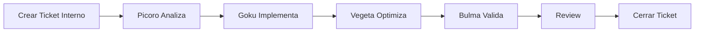

# AI SKILL DEVELOPMENT AND SPEC DRIVEN ASSISTANCE AI - Metodología Híbrida
## Sistema Multi-Proyecto con Agentes, Skills, Conocimientos, Especificaciones y Tickets

**Versión**: 2.2  
**Fecha**: 11 de Marzo 2026  
**Autor**: Dr. Francisco Ibarra Carlos  
**Nota**: v2.2 - Soporte multi-base de datos, gates obligatorios de selección/modelado y separación formal PWA vs REST API

---

## 1. Introducción

La metodología **AI SKILL DEVELOPMENT** y **SPEC DRIVEN ASSISTANCE AI** permite gestionar múltiples proyectos PWA de manera profesional, modular, reutilizable y trazable mediante:

- 🤖 **Agentes**: Entidades autónomas que ejecutan tareas
- 🎯 **Skills**: Capacidades reutilizables entre proyectos  
- 📚 **Knowledge**: Cuadernos de conocimiento local y remoto
- 🎫 **Tickets**: Control de cambios trazable
- 📋 **Specifications**: Especificaciones detalladas básica (inicial) e incrementales

---

## 2. Estructura del Folder ai_skill_dev1

```
ai_skill_dev1/
├── ai_global/                              # Recursos globales reutilizables
|   ├── AI_SKILL_DEVELOPMENT_METHODOLOGY.md # Este documento
│   ├── agents/                             # 🤖 Agentes de IA de Desarrollo
│   │   ├── README.md
│   │   ├── fic_picoro_agent_orchestrator.md
│   │   ├── fic_goku_agent_dev1.md
│   │   ├── fic_vegeta_agent_dev2.md
│   │   └── fic_bulma_agent_tester1.md
│   │
│   ├── skills/                      # 🎯 Skills de IA (documentación)
│   │   ├── README.md                # 🛠️ Índice de skills (habilidades)
│   ├── knowledge/                   # 📚 Conocimiento global
│   │   ├── README.md
│   │   ├── remote/                  # Enlaces externos
│   │   │   ├── README.md            # 🧠 Índice de conocimientos online
│   │   │   └── *.md
│   │   └── local/                   # Conocimiento interno
│   │       ├── README.md            # 🧠 Índice de conocimientos local
│   │       └── *.md
│   │
│   ├── templates/                   # 📋 Templates
│   │   ├── AGENT_TEMPLATE.md
│   │   ├── SKILL_TEMPLATE.md
│   │   ├── TICKET_TEMPLATE.md
│   │   ├── KNOWLEDGE_NOTE_TEMPLATE.md
│   │   ├── SPEC_INCREMENTAL_TEMPLATE.md
│   │   └── PROJECT_CONFIG_TEMPLATE.yaml
│   │
│   └── tickets/                           # 🎫 Tickets globales
│       ├── README.md
│       └── TKT-GLOBAL-###.md
│
├── packages/                    # Librerías compartidas (design system, utils, etc.)
│   ├── ui-library/              # Librería interna de componentes UI
│   │   ├── src/
│   │   ├── package.json
│   │   └── tsconfig.json
│   ├── utils/                   # Funciones utilitarias compartidas
│   │   ├── src/
│   │   ├── package.json
│   │   └── tsconfig.json
│   └── types/                   # Tipos globales compartidos
│       ├── src/
│       ├── package.json
│       └── tsconfig.json
|
└── projects/                              # Proyectos organizados por categoría
    ├── pwa/                               # Proyectos PWA
    │   ├── pwa_inversions_team5/          # Proyecto: Plataforma de Inversiones IA
    │   │   ├── public/
    │   │   ├── data/                # Contratos/modelos de referencia por base de datos
    │   │   │   ├── supabase/
    │   │   │   │   ├── models/
    │   │   │   │   ├── schema/
    │   │   │   │   └── data/
    │   │   │   ├── mongodb/
    │   │   │   │   ├── models/
    │   │   │   │   ├── schema/
    │   │   │   │   └── data/
    │   │   │   └── ...
    │   │   ├── ai_work_flow/         # ✅ Estructura metodológica del proyecto (fuera de src)
    │   │   │   ├── development/      # Instrucciones para agentes
    │   │   │   │   ├── workflow_agents.yaml  # Tareas de Picoro/Goku/Vegeta/Bulma
    │   │   │   │   └── README.md
    │   │   │   ├── docs/             # Documentación funcional/técnica
    │   │   │   │   ├── specs/
    │   │   │   │   │   ├── SPECIFICATION.md
    │   │   │   │   │   └── incremental/
    │   │   │   │   ├── templates/
    │   │   │   │   └── scripts/
    │   │   │   ├── knowledge/
    │   │   │   │   ├── README.md
    │   │   │   │   ├── remote/
    │   │   │   │   └── local/
    │   │   │   └── tickets/          # Tickets internos de desarrollo
    │   │   │       ├── README.md
    │   │   │       ├── TKT-INVRFIC-001.md
    │   │   │       ├── TKT-INVRFIC-002.md
    │   │   │       └── ...
    │   │   ├── src/                   # Código ejecutable de la PWA
    │   │   │   ├── assets/          # Recursos estáticos (imágenes, fuentes, estilos globales)
    │   │   │   ├── components/      # Componentes reutilizables
    │   │   │   │   └── ui/          # Atomic design: atoms, molecules, organisms
    │   │   │   ├── features/        # Módulos funcionales
    │   │   │   │   ├── dashboard/           # Dashboard principal
    │   │   │   │   ├── market-scanner/      # Escáner de mercado
    │   │   │   │   ├── options-chain/       # Cadena de opciones
    │   │   │   │   ├── signals/             # Motor de señales
    │   │   │   │   ├── portfolio/           # Gestión de portafolio
    │   │   │   │   ├── broker-connect/      # Conexión con brokers
    │   │   │   │   ├── backtesting/         # Backtesting de estrategias
    │   │   │   │   └── alerts/              # Sistema de alertas
    │   │   │   ├── hooks/           # Hooks globales
    │   │   │   ├── layouts/         # Layouts generales
    │   │   │   ├── pages/           # Páginas principales
    │   │   │   ├── routes/          # Configuración de rutas
    │   │   │   ├── services/        # Servicios externos
    │   │   │   │   ├── broker/              # Integración con brokers (IBKR, etc.)
    │   │   │   │   ├── market-data/         # Feeds de datos (TradingView, etc.)
    │   │   │   │   ├── indicators/          # Motor de indicadores técnicos
    │   │   │   │   ├── ai-analysis/         # Análisis con IA (Claude API)
    │   │   │   │   └── news/                # Servicio de noticias financieras
    │   │   │   ├── store/           # Estado global (Zustand/Redux)
    │   │   │   ├── styles/          # Estilos globales
    │   │   │   ├── utils/           # Funciones utilitarias
    │   │   │   ├── types/           # Tipos globales
    │   │   │   ├── App.tsx          # Componente raíz
    │   │   │   ├── main.tsx         # Punto de entrada
    │   │   │   └── vite-env.d.ts    # Tipos generados por Vite
    │   │   ├── tests/               # Pruebas unitarias e integración
    │   │   │   └── e2e/             # Pruebas end-to-end
    │   │   ├── index.html
    │   │   ├── package.json
    │   │   ├── tsconfig.json
    │   │   └── vite.config.ts
    │
    └── api/                               # Proyectos backend / APIs REST
      └── rest_api_inversions_team5/     # Persistencia real y exposición de endpoints
        ├── src/
        │   ├── routes/
        │   ├── controllers/
        │   ├── services/
        │   ├── models/
        │   ├── migrations/
        │   └── config/
        ├── DATABASE_CONFIG.yaml
        ├── .env.example
        ├── package.json
        └── tsconfig.json
```

### Convención de Código Fuente (SRC-First + Workflow-Root)

- Todo código React y TypeScript nuevo del proyecto se crea dentro de `src/`.
- Rutas válidas:
  - `packages/ui-library/src/...`
  - `packages/utils/src/...`
  - `packages/types/src/...`
  - `projects/pwa/pwa_inversions_team5/ai_work_flow/...`
  - `projects/pwa/pwa_inversions_team5/src/...`
  - `projects/api/rest_api_inversions_team5/src/...`
- `config.yaml` y `README.md` por componente son opcionales (modo Full), no obligatorios para ejecutar.
- Estandar operativo: todo nuevo desarrollo debe seguir la estructura oficial definida en esta metodologia.

---

## 3. Componentes Core

### 3.1 🤖 Agentes (Agents)

**Definición**: Entidad autónoma que ejecuta tareas usando uno o más skills.

**Ubicación**:
- Globales: `ai_skill_dev1/ai_global/agents/`
- Proyecto específico (workflow): `ai_skill_dev1/projects/pwa/pwa_inversions_team5/ai_work_flow/development/`
- Proyecto específico (código ejecutable): `ai_skill_dev1/projects/pwa/pwa_inversions_team5/src/`

**Ejemplo de configuración de módulo de inversiones**:
```yaml
# config.yaml
name: market_scanner_agent
version: 1.0.0
description: Agente para escaneo de mercado y detección de señales de trading
skills_required:
  - broker_connector
  - technical_indicators
  - signal_detector
  - ai_market_analyzer
configuration:
  scan_interval_seconds: 60
  max_concurrent_symbols: 50
  signal_confidence_threshold: 0.75
```

#### 3.1.1 Agentes de Desarrollo (AI Skill Development)

Estos son **4 agentes de IA operativos** que trabajan juntos en el ciclo de desarrollo. No son usuarios, son entidades autónomas con skills específicos.

**Ubicación**: `ai_skill_dev1/ai_global/agents/` (archivos.md)

```
🧠 fic_picoro_agent_orchestrator
- Rol: Analista/Arquitecto/Orquestador
- Skills: ticket_analyzer, architecture_designer, requirement_validator, knowledge_synthesizer
- CUÁNDO: FASE 2.3 (Investigación) y FASE 2.4 (Diseño)
- Función: Analiza SPECIFICATION.md, diseña arquitectura financiera, genera config.yaml

👨‍💻 fic_goku_agent_dev1
- Rol: Programador Senior #1
- Skills: react_code_generator, typescript_code_generator, vite_code_generator,
          tradingview_widgets_integrator, broker_api_integrator, documentation_writer,
          dependency_manager, code_structure_organizer
- CUÁNDO: FASE 2.4 (Estructura) y FASE 3 (Implementación)
- Función: Implementa código Vite, React, TypeScript; servicios de brokers,
           indicadores técnicos, módulos de señales, integración con APIs financieras
- Estándar de documentación: comentarios inline con prefijo FIC en inglés y español

🥷 fic_vegeta_agent_dev2
- Rol: Optimizador/Desarrollador Senior #2
- Skills: code_optimizer, performance_analyzer, security_auditor, pattern_refactorer
- CUÁNDO: FASE 3 (durante/después de Goku)
- Función: Optimiza latencia en feeds de datos de mercado, audita seguridad de
           credenciales de broker, refactoriza patrones de gestión de riesgo

🧪 fic_bulma_agent_tester1
- Rol: QA Tester/Guardiana de Calidad
- Skills: test_case_generator, bug_detector, quality_validator, regression_tester
- CUÁNDO: FASE 3 (después de Goku/Vegeta)
- Función: Crea tests para estrategias de trading, valida cálculos de indicadores,
           verifica precisión de señales de compra/venta
```

```
🗄️ fic_krillin_agent_db
- Rol: Especialista en Base de Datos
- Skills: database_schema_designer, database_migrator, database_connector
- CUÁNDO: FASE 2.4 (Diseño de BD) y FASE 3 (Implementación de datos, paralelo a Goku)
- Función: Diseña o valida el modelo de datos, traduce contratos de datos del proyecto PWA
           a persistencia real en `rest_api_inversions_team5`, ejecuta migraciones versionadas,
           implementa capa de servicio de datos y gestiona credenciales de forma segura
- Motores: Supabase, MongoDB, PostgreSQL, MySQL, SQLite, Firebase
- Regla crítica: NUNCA credenciales en código — solo variables de entorno
```

**Ciclo Completo**:

```
┌─ FASE 2.3 (Investigación) ─────────────────────┐
│ Picoro: Investiga APIs financieras, brokers,   │
│         estrategias a implementar              │
│ Deliverable: Arquitectura documentada          │
└────────────────────────────────────────────────┘
                        ↓
┌─ FASE 2.4 (Estructura) ────────────────────────┐
│ Goku: Crea estructura base, skeletons de       │
│       features de inversión                   │
│ Deliverable: Proyecto estructurado             │
└────────────────────────────────────────────────┘
                        ↓
┌─ FASE 3.1 (Implementación) ────────────────────┐
│ Goku: Implementa servicios/módulos:            │
│  - broker_connector, market_data               │
│  - technical_indicators, signal_detector       │
│  - options_chain, backtesting_engine           │
│ Deliverable: Código funcional                  │
└────────────────────────────────────────────────┘
                        ↓
        ┌───────────────┬──────────────┐
        ↓               ↓
    ┌─ VEGETA ──────┐  ┌─ BULMA ──────┐
    │ Optimiza      │  │ Crea tests   │
    │ latencia feeds│  │ Valida       │
    │ Seguridad API │  │ cálculos     │
    │ credenciales  │  │ indicadores  │
    └───────────────┘  └──────────────┘
          ↓                    ↓
        ┌──────────────────────┐
        ↓
    ┌─ APROBACIÓN ─────────┐
    │ Cálculos correctos?  │
    │ Señales precisas?    │
    │ Seguridad OK?        │
    │ Bugs = 0?            │
    └──────────────────────┘
          ↓ SÍ
    [MÓDULO LISTO]
```

**Regla de Oro**: Orden es **Picoro → Goku → (Vegeta ∥ Bulma) → Aprobación** ✅

**Regla de Oro (con Base de Datos)**: **Picoro → (Krillin ∥ Goku) → (Vegeta ∥ Bulma) → Aprobación** ✅

**Nota**: Krillin trabaja en paralelo a Goku desde FASE 2.4. Goku integra los servicios de datos de Krillin en sus features.

**Regla de Documentación Inline (Obligatoria)**:
- Todo archivo TypeScript/React implementado en FASE 3 debe incluir comentarios con prefijo `FIC`.
- Los comentarios `FIC` deben escribirse en inglés y español (EN/ES).
- Mínimo requerido: módulo, clases, hooks públicos, servicios de broker y bloques de lógica crítica de señales.
- La ausencia de este estándar bloquea el cierre del ticket hasta corregirse.

Ver: `ai_work_flow/development/workflow_agents.yaml` en cada proyecto para tareas específicas.

**Precedencia Operativa de Workflow (Regla Oficial)**:
- `ai_skill_dev1/development/workflow_agents.yaml` define la base global de referencia.
- `projects/<categoria>/<proyecto>/ai_work_flow/development/workflow_agents.yaml` es la fuente operativa oficial del proyecto.
- En caso de diferencia, siempre prevalece el workflow del proyecto.

---

### 3.1.2 📢 Protocolo de Visibilidad de Agente (Agent Activity Protocol)

> **Contexto**: En esta metodologia, todos los agentes son roles del mismo modelo IA activo en la sesion (GitHub Copilot, Claude, GPT-4, Gemini u otro). La metodologia es agnóstica al modelo: el modelo no cambia fisicamente — cambia de perspectiva y aplica las reglas del agente activo. Sin una senal explicita, el orquestador humano no sabe que agente esta actuando en cada momento.

> **Regla de oro**: Cada vez que el agente IA cambia de rol, inicia una tarea concreta o completa un bloque de trabajo, DEBE mostrar la cabecera de actividad correspondiente en el chat. No hacerlo es una violacion del protocolo.

#### Formato de cabecera obligatoria (AGENT HEADER)

Se muestra al **inicio** de cada bloque de trabajo de un agente:

```
---
🤖 @<id_agente> · <Rol> · FASE <X.X>
🎯 skill: <skill_activo>
📋 tarea: <descripcion breve de lo que va a hacer>
---
```

**Ejemplos reales**:

```
---
🧠 @picoro · Analista/Arquitecto · FASE 2.3
🎯 skill: knowledge_synthesizer
📋 tarea: Generar knowledge base de dominio de persistencia desde SPEC
---
```

```
---
🗄️ @krillin · Especialista BD · FASE 2.4
🎯 skill: database_schema_designer
📋 tarea: Diseñar schema SQL para Supabase cubriendo entidades de estrategias
---
```

```
---
👨‍💻 @goku · Dev Senior · FASE 3
🎯 skill: react_code_generator
📋 tarea: Implementar componente WatchlistPanel con datos de Supabase
---
```

#### Formato de cierre de tarea (COMPLETION LINE)

Se muestra al **final** de cada bloque de trabajo completado:

```
✅ @<id_agente> completó · <skill_activo> · output: <artefacto(s) generado(s)>
```

**Ejemplo**:
```
✅ @picoro completó · knowledge_synthesizer · output: knowledge/local/01_persistence_domain_research.md
```

#### Formato de transicion entre agentes (AGENT TRANSITION)

Se muestra cuando el control pasa de un agente a otro:

```
---
➡️ Transicion de agente
   @<agente_saliente> ──→ @<agente_entrante> · FASE <X.X>
   Contexto pasado: <que informacion se transfiere>
---
```

**Ejemplo**:
```
---
➡️ Transicion de agente
   @picoro ──→ @krillin · FASE 2.4
   Contexto pasado: knowledge base + trazabilidad SPEC->datos + gaps documentados
---
```

#### Reglas operativas

| Situacion | Accion requerida |
|-----------|-----------------|
| Agente inicia cualquier tarea | Mostrar AGENT HEADER antes del primer output |
| Agente termina un bloque de trabajo | Mostrar COMPLETION LINE |
| Control pasa de un agente a otro | Mostrar AGENT TRANSITION |
| Agente ejecuta un gate (pre-gate review o preguntas) | Incluir en AGENT HEADER el gate activo en lugar de skill |
| Tarea muy corta (una sola linea de respuesta) | Basta con la primera linea del header: `🧠 @picoro · ...` |

#### Cabeceras rapidas por agente (referencia)

| Agente | Primera linea | Emoji |
|--------|---------------|-------|
| `@picoro` | `🧠 @picoro · Analista/Arquitecto · FASE X.X` | 🧠 |
| `@krillin` | `🗄️ @krillin · Especialista BD · FASE X.X` | 🗄️ |
| `@goku` | `👨‍💻 @goku · Dev Senior · FASE X.X` | 👨‍💻 |
| `@vegeta` | `🥷 @vegeta · Optimizador/Seguridad · FASE X.X` | 🥷 |
| `@bulma` | `🧪 @bulma · QA Tester · FASE X.X` | 🧪 |

---

### 3.2 🎯 Skills de IA (Habilidades de Desarrollo)

**Definición**: Capacidades específicas de los agentes de IA para ejecutar tareas en el desarrollo.

**Skills de cada Agente**:
- **Picoro**: ticket_analyzer, architecture_designer, requirement_validator, knowledge_synthesizer
- **Goku**: react_code_generator, typescript_code_generator, vite_code_generator, tradingview_widgets_integrator, broker_api_integrator, documentation_writer, dependency_manager, code_structure_organizer
- **Vegeta**: code_optimizer, performance_analyzer, security_auditor, pattern_refactorer
- **Bulma**: test_case_generator, bug_detector, quality_validator, regression_tester

**NO confundir con**:
- **assets**: Recursos estáticos (logos brokers, íconos de instrumentos financieros) → `assets/<asset_name>.*`
- **components**: Componentes reutilizables de UI (CandlestickChart, IndicatorPanel) → `components/<component_name>.tsx`
- **ui**: Atomic design: atoms (Badge, Chip), molecules (SignalCard), organisms (WatchlistTable) → `components/ui/<ui_name>.tsx`
- **features**: Módulos funcionales de trading → `features/<feature_name>/`
- **hooks**: Hooks globales (useMarketData, useBrokerConnection) → `hooks/<hook_name>.tsx`
- **layouts**: Layouts generales (TradingLayout, DashboardLayout) → `layouts/<layout_name>.tsx`
- **pages**: Páginas principales (DashboardPage, SignalsPage) → `pages/<page_name>.tsx`
- **routes**: Configuración de rutas → `routes/<route_name>.tsx`
- **services**: Servicios externos (broker_connector, market_data_feed, ai_analysis) → `services/<service_name>.tsx`
- **store**: Estado global de mercado y portafolio → `store/<store_name>.tsx`
- **styles**: Estilos globales (tema dark trading) → `styles/<style_name>.tsx`
- **utils**: Funciones utilitarias (calcularRSI, formatearPrecio) → `utils/<util_name>.tsx`
- **types**: Tipos globales (Trade, Signal, Candle, OptionChain) → `types/<type_name>.tsx`

**Los skills de IA viven en**:
- `ai_global/skills/` como archivos `.md` independientes
- Se asignan a uno o más agentes en `ai_global/agents/*.md`
- Pueden ser extendidos por proyecto en `ai_work_flow/development/workflow_agents.yaml`

**Regla**: Un skill es reutilizable y puede ser asignado a múltiples agentes.

**Referencia**:
- Skills: [ai_global/skills/README.md](ai_global/skills/README.md)
- Agentes: [ai_global/agents/README.md](ai_global/agents/README.md)

#### 3.2.1 Registro de Skills (Locales y de Nube)

**Objetivo**: Mantener un catálogo único de skills de IA, sin importar si fueron creados por el equipo o descargados de la nube.

**Regla**: TODO skill nuevo se registra primero en `ai_global/skills/` antes de asignarse a agentes o proyectos.

**Pasos**:
1. Crear archivo `.md` del skill en `ai_global/skills/`.
2. Documentar: propósito, inputs/outputs, agentes compatibles, fuente (local o nube), versión y restricciones.
3. Asignar el skill en `ai_global/agents/<agente>.md`.
4. Si es por proyecto, agregar en `ai_work_flow/development/workflow_agents.yaml`.

**Skills de nube**:
- Se documentan igual que los skills locales.
- Se registra origen, versión, proveedor y forma de integración.
- Si requiere instalación (ej. librería TA-Lib, IBKR API), se documenta en el proyecto que lo use.

**Resultado**: Skills listos para ser asignados a uno o más agentes sin perder trazabilidad.

#### 3.2.2 Momento de Alta y Asignación de Skills por Proyecto

**Regla de oro**: Los skills nuevos se detectan por necesidad del proyecto durante FASE 2 y se formalizan antes de que el agente que los necesita empiece a ejecutar tickets de implementación.

**Secuencia obligatoria**:
1. **FASE 2.3 - Picoro detecta gaps**:
  - al analizar la SPEC, las bases de datos seleccionadas y las APIs externas requeridas,
  - identifica skills faltantes para Picoro, Krillin, Goku u otros agentes.
2. **Registro global del skill**:
  - crear o actualizar `ai_global/skills/<nuevo_skill>.md`
3. **Asignación metodológica del skill**:
  - actualizar `ai_global/agents/<agente>.md`
4. **Asignación operativa por proyecto**:
  - actualizar `projects/.../ai_work_flow/development/workflow_agents.yaml`
5. **Solo entonces**:
  - el agente usa formalmente ese skill en FASE 2.4 o FASE 3

**Ejemplo típico**:
- Picoro detecta que el proyecto requiere consumir una API nueva de noticias
- se crea `ai_global/skills/news_api_integrator.md`
- se asigna a Goku o Picoro según corresponda
- se agrega en `workflow_agents.yaml`
- luego se crean tickets que ya dependen de ese skill

**Regla adicional**:
- Si el skill es reusable entre proyectos, debe quedar en `ai_global/skills/`
- Si la necesidad nace por un proyecto concreto, igual se registra primero globalmente y luego se asigna localmente al workflow del proyecto

---

### 3.3 📚 Knowledge (Conocimiento)

**Definición**: Sistema híbrido de gestión de conocimiento que combina documentación local (.md) con referencias a fuentes externas y herramientas de IA en la nube.

**Principio Fundamental**: El conocimiento se genera ANTES de los tickets para informar las decisiones de implementación.

**Regla de Oro (Knowledge Base)**:
1. **Siempre** se consulta primero la base de conocimiento **GLOBAL** (`ai_global/knowledge/`).
2. **Luego** se aplica la base de conocimiento **DEL PROYECTO** (`projects/pwa/pwa_inversions_team5/ai_work_flow/knowledge/`).
3. El conocimiento del proyecto **especializa** al global, no lo reemplaza.

---

#### 3.3.1 Knowledge Local (`knowledge/local/`)

**Propósito**: Conocimiento generado mediante investigación profunda realizada por IA durante la fase de planificación.

**Tipos de Contenido**:
- 🔍 Investigación técnica de APIs de brokers y feeds de datos de mercado
- 📊 Patrones de implementación de indicadores técnicos (RSI, MACD, Bollinger Bands)
- 🧠 Estrategias de opciones documentadas (Iron Condor, Straddle, Strangle, etc.)
- 💡 Decisiones arquitectónicas sobre integración con Interactive Brokers / TradingView
- 📝 Lecciones aprendidas durante el desarrollo de módulos de trading
- 🧪 Comparaciones de librerías de indicadores técnicos

**Ubicación**:
- Global: `ai_skill_dev1/ai_global/knowledge/local/`
- Proyecto: `ai_skill_dev1/projects/pwa/pwa_inversions_team5/knowledge/local/`

**Convención de Nombres**:
```
01_<topic>_research.md         # Investigación numerada
02_<topic>_patterns.md         # Secuencia clara
03_<topic>_decisions.md        # Orden de lectura
04_<topic>_strategy.md         # Estrategia de implementación
lesson_<description>.md        # Lecciones aprendidas
examples/                      # Carpeta para ejemplos de código (opcional)
```

**Ejemplos de Código**:
El conocimiento local puede incluir código de tres formas:

1. **Snippets Embebidos** (< 30 líneas): Dentro de archivos .md de investigación
   ```markdown
   ## Patrón Recomendado: Conexión a Interactive Brokers
   ```typescript
   import { IBApi, EventName } from "@stoqey/ib";
   const ib = new IBApi({ port: 7497, clientId: 1 });
   ib.connect();
   ```
   ```

2. **Ejemplos Medianos** (30-100 líneas): En archivos .tsx dentro de `examples/`
   ```
   knowledge/local/examples/
   ├── README.md
   ├── ibkr_connection_demo.tsx
   ├── rsi_calculation_example.tsx
   ├── iron_condor_builder.tsx
   └── options_chain_parser.tsx
   ```

3. **Programas Completos**: Referenciados en `knowledge/remote/` (ver 3.3.2)

**Ejemplo — Investigación Técnica**:
```markdown
# 01_broker_api_research.md
## Investigación: Métodos de Conexión a Brokers con TypeScript

**Fecha**: 2026-03-03
**Investigador**: Claude AI (IA)
**Contexto**: Proyecto pwa_inversions_team5

### Objetivo
Determinar el mejor método para conectar la aplicación a brokers certificados
para ejecutar operaciones y obtener datos de mercado en tiempo real.

### Opciones Investigadas

#### Opción 1: Interactive Brokers TWS API (@stoqey/ib)
**Descripción**: Librería Node.js oficial para la API de IBKR
**Pros**:
- ✅ API oficial y certificada de Interactive Brokers
- ✅ Acceso completo a opciones, acciones, futuros
- ✅ Datos en tiempo real L1 y L2
- ✅ Ejecución de órdenes algorítmicas

**Contras**:
- ❌ Requiere TWS o IB Gateway corriendo localmente
- ❌ Configuración inicial compleja

**Código Ejemplo**:
```typescript
import { IBApi, EventName, Contract } from "@stoqey/ib";
const ib = new IBApi({ port: 7497, clientId: 1, host: "127.0.0.1" });
ib.on(EventName.connected, () => console.log("Broker conectado"));
ib.connect();
```

#### Opción 2: Alpaca API (REST + WebSocket)
**Descripción**: API REST moderna para trading de acciones y opciones
**Pros**:
- ✅ REST y WebSocket nativos
- ✅ Paper trading gratuito para desarrollo
- ✅ Sin software adicional local

**Contras**:
- ❌ Menor profundidad de mercado que IBKR
- ❌ Opciones con funcionalidades limitadas vs IBKR

### Decisión Final
**Selección**: Interactive Brokers (@stoqey/ib) como broker primario + Alpaca para paper trading

**Razones**:
1. IBKR es el estándar de la industria para trading algorítmico profesional
2. Soporte completo para cadena de opciones y estrategias complejas
3. Alpaca facilita el desarrollo y testing sin capital real
4. Arquitectura modular permite cambiar de broker sin reescribir lógica

**Aplicación**:
- Usar en servicio: `broker_connector`
- Implementar en: TKT-INVRFIC-001, TKT-INVRFIC-002

### Referencias
- [IBKR API Docs](knowledge/remote/ibkr_api_reference.md)
- [Alpaca API Docs](knowledge/remote/alpaca_api_reference.md)
```

**Ejemplo — Lección Aprendida**:
```markdown
# lesson_options_chain_latency.md
## Lección: Latencia en Streaming de Cadena de Opciones

**Fecha**: 2026-03-10
**Contexto**: Durante desarrollo de TKT-INVRFIC-007
**Problema**: Suscribir a todos los strikes de la cadena de opciones generaba
              demasiado tráfico y la UI se congelaba

### Situación
Al suscribirse a actualizaciones de precio en tiempo real de todos los strikes
y expiraciones del SPY, se recibían >500 mensajes/seg saturando el estado de React.

### Solución Encontrada
```typescript
// FIC: Throttle updates to max 2/sec per strike (EN)
// FIC: Limitar actualizaciones a máx 2/seg por strike (ES)
const throttledUpdate = useMemo(() =>
  throttle((data: OptionQuote) => dispatch(updateOptionQuote(data)), 500),
  [dispatch]
);
```

### Aplicación
- Patrón reutilizable en: todos los streams de datos de mercado
- Documentado en: TKT-INVRFIC-007
```

---

#### 3.3.2 Knowledge Remote (`knowledge/remote/`)

**Propósito**: Referencias a fuentes externas, documentación oficial de brokers y APIs financieras, herramientas cloud de análisis, y código interno de referencia.

**Tipos de Contenido**:
- 🔗 URLs a documentación oficial de brokers (IBKR, Alpaca, TDAmeritrade)
- 📚 APIs de datos de mercado (TradingView, Polygon.io, Alpha Vantage)
- 🌐 Tutoriales de estrategias de opciones y análisis técnico
- ☁️ **NotebookLM** y otras herramientas de IA para investigación
- 📖 Estándares regulatorios (SEC, FINRA) relevantes
- 🏠 **Referencias internas** a código propio existente
- 📊 Recursos educativos de indicadores técnicos (RSI, MACD, Bollinger, etc.)

**Ubicación**:
- Global: `ai_skill_dev1/ai_global/knowledge/remote/`
- Proyecto: `ai_skill_dev1/projects/pwa/pwa_inversions_team5/knowledge/remote/`

**Estructura de Archivo Remote**:
```markdown
# <topic>_reference.md
## [Título de la Fuente]

**Tipo**: Documentación Oficial / Tutorial / NotebookLM / API Reference / Otro
**URL**: <enlace directo>
**Fecha creación**: YYYY-MM-DD
**Última verificación**: YYYY-MM-DD
**Acceso**: Público / Requiere cuenta / Requiere API Key

### Resumen
[Breve descripción del contenido y su relevancia para el proyecto]

### Puntos Clave
- Endpoint o concepto importante 1
- Endpoint o concepto importante 2
- Limitaciones o rate limits relevantes

### Aplicación en Proyecto
[Cómo se aplica en pwa_inversions_team5]

### Relacionado con
- Knowledge local: 01_topic_research.md
- Tickets: TKT-INVRFIC-001, TKT-INVRFIC-005
```

**Ejemplo — Documentación Oficial IBKR**:
```markdown
# ibkr_api_reference.md
## Interactive Brokers TWS API Documentation

**Tipo**: Documentación Oficial Interactive Brokers
**URL**: https://interactivebrokers.github.io/tws-api/
**Fecha creación**: 2026-03-03
**Última verificación**: 2026-03-03
**Acceso**: Público

### Resumen
Documentación oficial de la API de IBKR para conexión, obtención de datos
de mercado en tiempo real y ejecución de órdenes programáticas.

### Puntos Clave
- reqMktData(): Suscribirse a precios en tiempo real
- placeOrder(): Enviar órdenes de compra/venta
- reqOptionChain(): Obtener cadena de opciones
- reqHistoricalData(): Obtener velas históricas (OHLCV)
- Rate limits: 50 solicitudes de datos de mercado simultáneas (cuenta básica)

### Aplicación en Proyecto
Base técnica para implementación del servicio `broker_connector`
y el módulo `options_chain` en pwa_inversions_team5.

### Relacionado con
- Knowledge local: 01_broker_api_research.md
- Tickets: TKT-INVRFIC-001 (Broker Connection), TKT-INVRFIC-007 (Options Chain)
```

**Ejemplo — TradingView Widgets**:
```markdown
# tradingview_widgets_reference.md
## TradingView Lightweight Charts & Widgets

**Tipo**: Documentación Oficial / Librería Open Source
**URL**: https://tradingview.github.io/lightweight-charts/
**Fecha creación**: 2026-03-03
**Última verificación**: 2026-03-03
**Acceso**: Público (MIT License)

### Resumen
Librería oficial de TradingView para renderizar gráficas financieras de alto
rendimiento en aplicaciones web: velas japonesas, líneas, indicadores superpuestos.

### Puntos Clave
- createChart(): Inicializa chart container con opciones de tema
- addCandlestickSeries(): Agrega serie de velas OHLCV
- addLineSeries(): Agrega indicadores como SMA, EMA, Bollinger
- update() en tiempo real: Actualiza última vela sin re-render completo
- Soporte nativo para tema oscuro (ideal para plataformas de trading)

### Aplicación en Proyecto
Principal librería de visualización para el módulo `market-scanner`
y las páginas de detalle de símbolo en pwa_inversions_team5.

### Relacionado con
- Knowledge local: 02_charting_patterns.md
- Tickets: TKT-INVRFIC-003 (Charting Module)
```

**Ejemplo — NotebookLM**:
```markdown
# notebooklm_main_research.md
## NotebookLM: Investigación Profunda Proyecto pwa_inversions_team5

**Tipo**: NotebookLM (Google AI)
**URL**: https://notebooklm.google.com/notebook/<id_del_notebook>
**Fecha creación**: 2026-03-03
**Última actualización**: 2026-03-03
**Acceso**: Requiere cuenta de Google (fibarrac@elnayar.com)

### Descripción
Notebook de investigación con análisis profundo de todos los documentos del
proyecto de inversiones usando IA de Google.

### Fuentes Subidas a NotebookLM
- ✅ SPECIFICATION.md (especificación completa del proyecto)
- ✅ Knowledge local generado (01_*.md a 05_*.md)
- ✅ Documentación de IBKR API
- ✅ Documentación de TradingView Lightweight Charts
- ✅ Referencias de estrategias de opciones (Iron Condor, Straddle, etc.)

### Capacidades de Este Notebook
- 💬 Responde preguntas sobre el proyecto de inversiones
- 📊 Genera resúmenes de estrategias de opciones
- 🔍 Encuentra inconsistencias entre documentos de requerimientos
- 💡 Sugiere mejoras en la lógica de señales de trading
- 📝 Crea guías para implementación de indicadores

### Preguntas Clave Ya Respondidas
1. **¿Qué indicadores combinar para generar señales de mayor confianza?**
   - Respuesta: RSI(14) + MACD(12,26,9) + Bollinger Bands(20,2) como confirmación triple
   
2. **¿Cómo detectar cuándo los institucionales están posicionados?**
   - Respuesta: Analizar Open Interest + Volume en opciones ATM y analizar dark pool prints

3. **¿Cuál es la mejor frecuencia de actualización para el scanner?**
   - Respuesta: 1 minuto para señales intraday, 15 min para swing trading

### Hallazgos Adicionales del Análisis IA
[El usuario copia aquí los insights importantes que NotebookLM genere durante el desarrollo]

### Cómo Usar Este Notebook
1. Acceder al URL con cuenta autorizada
2. Hacer preguntas específicas durante el desarrollo de cada módulo
3. Consultar antes de tomar decisiones sobre lógica de señales
4. Actualizar con nuevo conocimiento generado durante el desarrollo

### Relacionado con
- Proyecto: pwa_inversions_team5
- Knowledge local: todos los archivos 01_*.md a 05_*.md
- Todos los tickets (contexto general)
```

---

#### 3.3.3 Flujo de Generación de Conocimiento

**Momento**: ANTES de generar tickets (parte de FASE 2.3)

**Proceso**:

```
┌─────────────────────────────────────────────────────┐
│ PASO 1: IA Analiza SPECIFICATION.md                 │
└─────────────────────────────────────────────────────┘
                        ↓
         Identifica áreas que requieren investigación:
         - APIs de brokers a integrar (IBKR, Alpaca)
         - Librerías de indicadores técnicos
         - Estrategias de opciones a implementar
         - Fuentes de datos de mercado y noticias

┌─────────────────────────────────────────────────────┐
│ PASO 2: IA Genera Knowledge Local (.md)             │
└─────────────────────────────────────────────────────┘
                        ↓
         knowledge/local/
         ├── 01_broker_api_research.md
         ├── 02_charting_library_research.md
         ├── 03_technical_indicators_patterns.md
         ├── 04_options_strategies_decisions.md
         └── 05_ai_signal_analysis_strategy.md

┌─────────────────────────────────────────────────────┐
│ PASO 3: IA Genera Knowledge Remote (.md)            │
└─────────────────────────────────────────────────────┘
                        ↓
         knowledge/remote/
         ├── ibkr_api_reference.md
         ├── alpaca_api_reference.md
         ├── tradingview_widgets_reference.md
         ├── polygon_io_market_data.md
         ├── talib_indicators_reference.md
         └── notebooklm_placeholder.md  (usuario completa)

┌─────────────────────────────────────────────────────┐
│ PASO 4: Usuario Crea NotebookLM (Opcional)          │
└─────────────────────────────────────────────────────┘
                        ↓
         1. Accede a notebooklm.google.com
         2. Crea notebook del proyecto de inversiones
         3. Sube: SPECIFICATION.md + knowledge local + docs de APIs
         4. Hace preguntas sobre estrategias y lógica de señales
         5. Obtiene URL del notebook

┌─────────────────────────────────────────────────────┐
│ PASO 5: Usuario Completa Remote Reference           │
└─────────────────────────────────────────────────────┘
                        ↓
         Actualiza knowledge/remote/notebooklm_*.md
         con URL y hallazgos clave de trading

┌─────────────────────────────────────────────────────┐
│ PASO 6: IA Genera Tickets (Usa Knowledge)           │
└─────────────────────────────────────────────────────┘
                        ↓
         Cada ticket referencia conocimiento necesario:
         
         # TKT-INVRFIC-001: Implementar Broker Connector
         ## Conocimiento Requerido
         - 📄 knowledge/local/01_broker_api_research.md
         - 🔗 knowledge/remote/ibkr_api_reference.md
         - ☁️ knowledge/remote/notebooklm_main.md
```

**Resultado**: Desarrollador tiene contexto completo de las APIs financieras y estrategias ANTES de codificar.

**Momento exacto en la metodología**:
- `knowledge/local/` y `knowledge/remote/` se generan en **FASE 2.3**
- ocurren **después** de `DATABASE SELECTION GATE`, `SPECIFICATION GATE` y `DATABASE MODEL GATE`
- ocurren **antes** de crear tickets internos y antes de la implementación funcional de FASE 2.4 / FASE 3

**Uso práctico**:
- `knowledge/local/`: investigación profunda, decisiones internas, patrones, comparativas, hallazgos de arquitectura
- `knowledge/remote/`: referencias oficiales, docs externas, endpoints, SDKs, NotebookLM, fuentes regulatorias y documentación de APIs

**Regla de dependencia**:
- Si un ticket depende de una API, librería o motor no trivial, primero debe existir conocimiento suficiente en `knowledge/local/` y/o `knowledge/remote/`

---

#### 3.3.4 Gestión Híbrida durante Desarrollo

**Durante FASE 3 (desarrollo de tickets)**:

1. **Desarrollador lee conocimiento**
   - Revisa local/ para entender decisiones de indicadores y estrategias
   - Consulta remote/ para referencias de APIs de brokers y librerías
   - Usa NotebookLM para preguntas específicas de lógica financiera

2. **Desarrollador implementa**
   - Sigue patrones documentados de conexión a broker
   - Aplica decisiones arquitectónicas de cálculo de indicadores
   - Implementa estrategias de opciones según especificación

3. **Desarrollador documenta lecciones**
   - Si encuentra latencia inesperada en feeds → crea `lesson_market_data_latency.md`
   - Si descubre comportamiento de API no documentado → actualiza knowledge
   - Si cambia librería de indicadores → documenta razón con benchmarks

**Beneficios**:
- ✅ Menos re-trabajo en lógica de señales
- ✅ Decisiones informadas sobre brokers y feeds de datos
- ✅ Conocimiento de estrategias financieras preservado
- ✅ Equipo alineado en métricas de riesgo y criterios de señales

---

#### 3.3.5 Estructura de README y Trazabilidad Temporal

**Propósito**: Cada carpeta `knowledge/` (raíz, local/, remote/) debe tener un README.md que proporciona:
1. **Estado Actual** visible para IA/metodología
2. **Historial de Estado** para auditoría temporal
3. **Métricas** de contenido generado

**Template**: [README_KNOWLEDGE_TEMPLATE.md](ai_global/templates/README_KNOWLEDGE_TEMPLATE.md)

**Estructura Estándar del README**:

```markdown
## 📋 Estado Actual

| Aspecto | Estado | Última Actualización |
|---------|--------|----------------------|
| **Investigación de Brokers** | ✅ Generado | 2026-03-03 10:00 |
| **Librerías de Indicadores** | ✅ Generado | 2026-03-03 10:00 |
| **Estrategias de Opciones** | ⏳ En proceso | 2026-03-03 12:30 |
| **Fase del Proyecto** | FASE 2 | - |

## 📊 Métricas de Conocimiento

| Métrica | Valor |
|---------|-------|
| Archivos de investigación (local) | 5 |
| Referencias externas (remote) | 9 |
| Tickets informados | 0 |
| Estrategias documentadas | 8 |

## 📅 Historial de Estado

| Fecha | Hora | Estado Anterior | Estado Nuevo | Evento | Notas |
|-------|------|-----------------|--------------|--------|-------|
| 2026-03-03 | 10:00 | 🚧 Estructura | ✅ Generado | Investigación brokers | 5 local + 9 remote |
| 2026-03-02 | 09:00 | - | 🚧 Estructura | Setup | Directorios creados |
```

**Principios del Historial**:
1. **Estado Actual arriba**: Para que IA pueda encontrar rápidamente la fase actual
2. **Historial completo abajo**: Para auditoría y análisis de progreso
3. **Fechas/horas precisas**: Permite análisis temporal
4. **Eventos descriptivos**: Contexto de qué pasó en cada cambio
5. **Notas con métricas**: Cantidad de archivos, decisiones de estrategias tomadas

**Convenciones de Estado**:
- 🚧 **Pendiente**: Trabajo no iniciado o estructura básica
- ✅ **Generado/Completado**: Trabajo finalizado y validado
- ⏳ **En proceso**: Trabajo activo en este momento
- ❌ **Bloqueado**: Trabajo detenido por dependencias

---

### 3.4 🎫 Tickets

**Convención de Nombres**:
- Global: `TKT-GLOBAL-###`
- Proyecto Inversiones: `TKT-INVRFIC-###`

**Estados**: Open → In Progress → Review → Closed

**Política de Cierre (Obligatoria)**:
- `Closed` (o ✅ Completado) SOLO se permite con evidencia de prueba.
- Evidencia mínima: resultado de tests (unitarios/integración o validación manual documentada), fecha, entorno y responsable.
- Para módulos de trading: incluir validación de cálculos de indicadores vs. fuente de referencia (ej. TradingView).
- Si el código está implementado pero sin validación ejecutada, el estado correcto es `Review`.
- Está prohibido cerrar tickets por "código terminado" sin ejecución comprobada.

**Estructura Mínima**:
```markdown
# TKT-INVRFIC-003: Implementar módulo de indicadores técnicos

## Metadata
- Tipo: Feature
- Prioridad: Alta
- Estado: In Progress
- Proyecto: pwa_inversions_team5

## Descripción
Implementar cálculo de RSI(14), MACD(12,26,9) y Bollinger Bands(20,2)
sobre datos OHLCV en tiempo real.

## Archivos Afectados
- src/services/indicators/rsi.service.ts
- src/services/indicators/macd.service.ts
- src/services/indicators/bollinger.service.ts

## Trazabilidad
- Relacionado: TKT-GLOBAL-005 (skill global de cálculo de indicadores)
- Knowledge: knowledge/local/03_technical_indicators_patterns.md
```

---

## 4. FASE 0: Configuración Inicial del Sistema (Setup Único)
## 3.5 🗄️ Base de Datos (Database Configuration)

**Definición**: La arquitectura de datos se divide en dos capas obligatorias. La PWA documenta contratos y estructuras de referencia; la persistencia real, migraciones y acceso a base de datos viven en el proyecto backend `rest_api_inversions_team5`.

**Agente responsable**: `@krillin` — `ai_global/agents/fic_krillin_agent_db.md`

**Archivo de configuración por proyecto backend**: `DATABASE_CONFIG.yaml` en `projects/api/rest_api_inversions_team5/`  
**Template base**: `ai_global/templates/DATABASE_CONFIG_TEMPLATE.yaml`

---

### 3.5.1 Soporte Multi-Base de Datos

La metodología asume desde el inicio que un proyecto puede trabajar con **una o más bases de datos**. La selección nunca se infiere por defecto; siempre se pregunta al responsable humano.

**Lista base recomendada para desarrollo asistido por IA**:

| Motor | Tipo | Cuándo usarlo |
|-------|------|---------------|
| **Supabase** | PostgreSQL managed + Auth + Storage | App con autenticación, datos relacionales, MCP nativo |
| **MongoDB** | NoSQL document | Datos flexibles, documentos anidados, escala horizontal |
| **PostgreSQL directo** | SQL | Control total, sin SaaS overhead |
| **MySQL / MariaDB** | SQL | Proyectos en hosting propio o entornos existentes |
| **SQLite** | SQL embebido | Prototipos, testing local, utilidades internas |
| **Firebase Firestore** | NoSQL managed | Sincronización rápida, escenarios mobile-first |
| **Otro** | Configurable | Documentar en `DATABASE_CONFIG.yaml` |

---

### 3.5.2 Separación Formal: PWA vs REST API

**Regla de arquitectura**:

| Capa | Proyecto | Responsabilidad |
|------|----------|-----------------|
| Contrato de datos | `projects/pwa/pwa_inversions_team5/` | Documentar modelos de referencia, schema y datos seed de apoyo |
| Persistencia real | `projects/api/rest_api_inversions_team5/` | Conectar a BD real, ejecutar migraciones, exponer endpoints REST |

**En la PWA sí existe**:
- `data/<alias_db>/models/` para contratos de datos
- `data/<alias_db>/schema/` para definición documental del esquema
- `data/<alias_db>/data/` para seeds de ejemplo o fixtures

**En la PWA no existe**:
- conexión real a base de datos
- migraciones ejecutables contra producción/desarrollo
- credenciales de base de datos

**En `rest_api_inversions_team5` sí existe**:
- models reales de ORM/ODM
- migrations
- controllers, routes y services
- `.env.example` y variables de entorno reales

**Flujo obligatorio**:
```
PWA data/* = contrato y referencia
          ↓
Krillin traduce ese contrato
          ↓
rest_api_inversions_team5 = implementación real de persistencia y REST API
```

---

### 3.5.3 DATABASE SELECTION GATE

> **Regla de oro**: Antes de revisar la SPEC principal en FASE 2, la IA debe preguntar explícitamente en qué base o bases de datos trabajará la solución.

**Objetivo**: Confirmar si el proyecto usará 1, 2 o más motores y cuáles serán.

**Pregunta obligatoria al responsable humano**:
```
🔓 DATABASE SELECTION GATE
Selecciona la(s) base(s) de datos del proyecto.

Opciones recomendadas:
- Supabase
- MongoDB
- PostgreSQL
- MySQL/MariaDB
- SQLite
- Firebase Firestore
- Otro

Puedes elegir una o varias.
Indica exactamente cuáles usarás.
```

**Respuestas válidas**:
- `Supabase`
- `MongoDB`
- `Supabase + MongoDB`
- `PostgreSQL + SQLite`

**Reglas**:
- La IA no puede asumir un motor por defecto.
- Supabase y MongoDB deben aparecer siempre en el listado mostrado.
- La selección debe quedar documentada en la SPEC y en `DATABASE_CONFIG.yaml` del backend.

---

### 3.5.4 DATABASE MODEL GATE

> **Regla de oro**: Después de seleccionar las bases de datos y antes de que Krillin construya persistencia real, la IA debe preguntar quién definirá el modelo de datos de cada motor seleccionado.

**Pregunta obligatoria al responsable humano**:
```
🔓 DATABASE MODEL GATE
Ya seleccionaste las siguientes bases de datos: <lista>.

Para cada una, indica una de estas dos opciones:
1. Yo te pasaré el modelo/schema ya construido.
2. Quiero que la IA proponga el modelo/schema.
```

**Si el usuario responde que entregará los modelos**:
- Debe colocarlos en la PWA como contrato de referencia:
  - `projects/pwa/pwa_inversions_team5/data/supabase/models/`
  - `projects/pwa/pwa_inversions_team5/data/supabase/schema/`
  - `projects/pwa/pwa_inversions_team5/data/supabase/data/`
  - `projects/pwa/pwa_inversions_team5/data/mongodb/models/`
  - `projects/pwa/pwa_inversions_team5/data/mongodb/schema/`
  - `projects/pwa/pwa_inversions_team5/data/mongodb/data/`

**Si el usuario responde que la IA debe crearlos**:
- `@picoro` define la propuesta conceptual desde la SPEC
- `@krillin` la aterriza a cada motor seleccionado
- No se ejecuta ninguna migración sin aprobación explícita del responsable

**Reglas**:
- La decisión puede ser distinta por cada base de datos seleccionada.
- Los modelos en `data/` son contrato documental; la implementación real se crea en `rest_api_inversions_team5`.

### 3.5.4.1 MODEL MATURITY GATE (Draft -> Candidate -> Approved)

> **Regla de oro**: Un modelo de datos generado antes de completar conocimiento profundo es valido solo como borrador tecnico. No puede usarse para migraciones ni cierre de diseno.

**Estados obligatorios por motor**:

| Estado | Uso permitido | Uso prohibido |
|-------|---------------|---------------|
| `draft` | Prototipo, validacion temprana de estructura, contratos iniciales | Migraciones, cierre de fase, cierre de ticket de diseno |
| `candidate` | Revision tecnica contra SPEC y knowledge | Migraciones sin aprobacion formal |
| `approved` | Base oficial para migraciones en DEV y construccion de servicios | Saltar validaciones de credenciales o aprobaciones destructivas |

**Criterios minimos para pasar a `candidate`**:
- Knowledge local/remote generado para el dominio de datos
- Matriz de trazabilidad SPEC -> entidades/campos/reglas
- Gaps y riesgos documentados

**Criterios minimos para pasar a `approved`**:
- Revision humana explicita del responsable
- Decisiones entre motores seleccionados cerradas por entidad
- Confirmacion de que no hay conflictos abiertos con tickets incrementales activos

**Reglas operativas**:
- No ejecutar migraciones con estado `draft`.
- No cerrar tickets de modelado si algun motor activo no esta al menos en `candidate`.
- No marcar fase de diseno como completada si un motor activo no esta en `approved`.

---

### 3.5.5 Especificar Cuenta y Cluster

En `DATABASE_CONFIG.yaml` se definen:
- `account.provider`: proveedor cloud (supabase.com, mongodb.com/atlas, etc.)
- `account.owner_email`: cuenta/email owner del entorno (solo referencia, sin contraseñas)
- `account.project_name`: nombre del proyecto en el proveedor
- `account.project_ref`: ID único del proyecto (Supabase project ref, MongoDB cluster name)
- `account.region`: región del cluster
- `account.environment`: development | staging | production

**Momento en que la IA lo pide**:
- Inmediatamente después del `DATABASE SELECTION GATE` y antes de cerrar FASE 2.2.
- La solicitud se hace **por cada motor seleccionado**.
- En este punto solo se piden atributos **no secretos**: proveedor, proyecto/cluster, región, environment, owner y referencias del recurso.

**Pregunta obligatoria al responsable humano por cada motor habilitado**:
```text
Confirma los atributos de conexión no secretos para <motor>:
- provider
- owner_email
- project_name
- project_ref o cluster_name
- region
- environment
```

**Ejemplo para Supabase**:
```yaml
account:
  provider: "supabase.com"
  owner_email: "fibarrac@elnayar.com"
  project_name: "rest-api-inversions-team5"
  project_ref: "abcdefghijklmnop"
  region: "us-east-1"
  environment: "development"
```

---

### 3.5.6 Protocolo de Credenciales (Regla de Oro)

```
❌ NUNCA en:           ✅ SIEMPRE en:
  Código fuente          .env (gitignored, llenado por owner)
  DATABASE_CONFIG.yaml   .env.example (nombres sin valores, commiteable)
  Archivos .md           Variables de entorno del sistema (CI/CD)
  Repositorio git
```

**Krillin solo genera `.env.example`** dentro de `projects/api/rest_api_inversions_team5/`. El responsable del proyecto llena el `.env` real localmente con las credenciales de la cuenta/cluster indicada en `DATABASE_CONFIG.yaml`.

**Momento en que la IA pide secretos reales**:
- Al inicio de FASE 2.4, cuando Krillin ya generó o completó `.env.example` para los motores habilitados.
- La solicitud se hace **por cada base de datos habilitada** y solo para las variables declaradas en `env_variables`.
- Si falta alguna variable real, Krillin **debe pausar** antes de conectar, validar vía MCP o ejecutar migraciones.

**Ejemplos de lo que sí se solicita en este momento**:
- Supabase: `SUPABASE_URL`, `SUPABASE_ANON_KEY`, `SUPABASE_SERVICE_ROLE_KEY`, `SUPABASE_DB_PASSWORD`
- MongoDB: `MONGODB_URI`, `MONGODB_DB_NAME`, `MONGODB_USER`, `MONGODB_PASSWORD`
- PostgreSQL: `DATABASE_URL` o `DB_HOST`, `DB_PORT`, `DB_NAME`, `DB_USER`, `DB_PASSWORD`

**Regla operativa**:
- FASE 2.2: se pide selección de motores y metadata no secreta por motor.
- FASE 2.3: se resuelve modelado por motor.
- FASE 2.4: se genera `.env.example` y recién ahí se solicitan los secretos reales por motor.
- FASE 3 no inicia contra una base real si el `.env` de algún motor activo está incompleto.

---

### 3.5.7 Plantillas Reutilizables de Preguntas (Por Motor)

Estas plantillas se usan literalmente para evitar ambigüedad y asegurar que la solicitud se hace por cada base habilitada.

**Plantilla A - FASE 2.2 (atributos no secretos, por motor)**

```text
DATABASE CONNECTION METADATA CHECK - <motor>

Confirma estos atributos no secretos para <motor>:
1) provider:
2) owner_email:
3) project_name:
4) project_ref o cluster_name:
5) region:
6) environment: (development | staging | production)

Nota: en esta fase NO se solicitan passwords, tokens ni connection strings.
```

**Plantilla B - FASE 2.4 (secretos reales, por motor activo)**

```text
DATABASE SECRETS CHECK - <motor>

Krillin ya generó .env.example para <motor>.
Comparte ahora los valores reales de estas variables para tu .env local:
- <VAR_1>
- <VAR_2>
- <VAR_3>

Si no deseas compartirlos por chat, confírmame únicamente:
1) "ya están cargadas en .env"
2) "pendiente cargar"

Bloqueo: no se ejecutarán conexión, migraciones ni validación MCP para <motor> hasta confirmar estado completo.
```

**Checklist de cierre por cada motor habilitado**:
- [ ] Metadata no secreta capturada en `DATABASE_CONFIG.yaml`
- [ ] Estrategia de modelo definida (`provided_by_user` o `generate_by_ai`)
- [ ] Variables requeridas listadas en `.env.example`
- [ ] Estado de secretos confirmado en `.env` local

---

### 3.5.8 Cuándo se Ejecuta Krillin

| Fase | Acción |
|------|--------|
| FASE 2.3 | Después del `DATABASE MODEL GATE`: valida contratos en `pwa/.../data/` o propone el modelo por motor seleccionado |
| FASE 2.4 | Diseña la persistencia real en `projects/api/rest_api_inversions_team5/` → genera `.env.example` y solicita credenciales reales por cada motor activo |
| FASE 3 | Implementación: ejecuta migrations en development solo si el `.env` por motor está completo → implementa services/controllers/routes → entrega a Goku contratos/endpoints para integrar en la PWA |

**Nota de control**:
- Si Krillin recibe un modelo en estado `draft`, debe tratarlo como insumo temporal y abrir/actualizar ticket para madurez de modelo antes de migrar.

---

### 3.5.9 PRE-GATE REVIEW PANEL — Protocolo de revision previa obligatoria

> **Regla de oro**: Antes de lanzar las preguntas formales de cualquier gate que involucre artefactos existentes, la IA debe presentar un panel de revision con **enlaces directos** a esos artefactos para que el responsable los consulte antes de responder.

**Motivacion**: El responsable humano no puede tomar decisiones informadas sin ver los documentos relevantes. Lanzar preguntas sin contexto visible obliga al usuario a buscar archivos por su cuenta, lo que rompe el flujo de revision.

**Protocolo obligatorio — dos pasos sin excepcion**:

| Paso | Accion | Herramienta |
|------|--------|-------------|
| 1 | Presentar PRE-GATE REVIEW PANEL con enlaces markdown a todos los artefactos involucrados | Mensaje de chat (markdown) |
| 2 | Lanzar las preguntas formales del gate | `vscode_askQuestions` |

**El paso 1 siempre precede al paso 2. No se lanzan preguntas sin panel previo.**

**Formato de panel requerido**:

```
📋 PRE-GATE REVIEW — <NOMBRE DEL GATE>

Antes de responder las preguntas formales, revisa los siguientes artefactos:

| Artefacto | Descripcion | Estado actual |
|-----------|-------------|---------------|
| [nombre.md](ruta/relativa/nombre.md) | Que contiene | draft / candidate / approved |
| ... | ... | ... |

Cuando hayas revisado los artefactos relevantes, responde las preguntas del gate a continuacion.
```

**Reglas operativas**:
- Los enlaces deben ser rutas relativas al workspace para que VS Code los resuelva como ficheros abribles con un click.
- Si un artefacto no existe aun, se indica como `pendiente` en lugar de enlace roto.
- El panel incluye **solo** los artefactos evaluados por ese gate especifico, no todos los del proyecto.
- Si el gate es `per_engine: true`, el panel agrupa los artefactos por motor.
- Si el gate no involucra ningun artefacto existente (ej. primer gate de una fase), se omite el panel.

**Artefactos obligatorios por tipo de gate**:

| Gate | Artefactos obligatorios en panel |
|------|----------------------------------|
| `DATABASE_SELECTION_GATE` | Ninguno (primer gate, sin artefactos previos) |
| `DATABASE_MODEL_GATE` | SPEC principal, `DATABASE_CONFIG.yaml` del backend |
| `MODEL_MATURITY_GATE` | Modelos por motor (`data/<motor>/models/`), schema (`data/<motor>/schema/`), trazabilidad (`knowledge/local/03_*`), gaps (`knowledge/local/04_*`) |
| `DATABASE_SECRETS_CHECK` | `.env.example` del backend |
| Gate de cierre de fase | Todos los outputs de esa fase que ya existen |

---

## 3.6 🔌 MCP (Model Context Protocol) — Integración de Agente con Base de Datos

**Qué es MCP**: Protocolo que permite conectar el agente IA directamente a servicios externos (bases de datos, APIs) durante una sesión de chat, sin necesidad de implementar código intermedio.

**Para qué se usa en esta metodología**:
- Krillin puede consultar el schema real de Supabase o MongoDB durante diseño
- Krillin puede ejecutar queries de validación sobre la BD real
- Copilot/modelo IA tiene contexto directo del estado de la base de datos

### 3.6.1 Servidores MCP disponibles

| Motor | Paquete MCP | Notas |
|-------|-------------|-------|
| Supabase | `@supabase/mcp-server-supabase` | Requiere Personal Access Token de supabase.com |
| MongoDB Atlas | `mongodb-mcp-server` | Requiere API Key pública y privada de Atlas |
| PostgreSQL | `@modelcontextprotocol/server-postgres` | Requiere cadena de conexión |

### 3.6.2 Dónde se configura el MCP

La configuración técnica vive en:  
**`.vscode/mcp.json`** (a nivel workspace de VS Code)

```json
{
  "servers": {
    "supabase": {
      "type": "stdio",
      "command": "npx",
      "args": ["-y", "@supabase/mcp-server-supabase@latest", "--access-token", "${input:SUPABASE_ACCESS_TOKEN}"]
    }
  }
}
```

El template base está en: `.vscode/mcp.json` (ya creado en este proyecto).

### 3.6.3 Credenciales del MCP

- Se leen como `${input:NOMBRE_VARIABLE}` — VS Code los solicita interactivamente al activar el servidor
- No se almacenan en el repositorio
- El responsable del proyecto ingresa las credenciales manualmente en su sesión local

### 3.6.4 Relación MCP con la metodología

El MCP es una capa de **herramienta de sesión**, no de metodología:

```
Capa metodológica (permanente):
  projects/api/rest_api_inversions_team5/DATABASE_CONFIG.yaml
  → fic_krillin_agent_db.md → skills/ → migrations/

Capa MCP (opcional, por sesión):
  .vscode/mcp.json → activa acceso directo del agente a la BD en la sesión actual
```

- La metodología **referencia** el MCP a través de `DATABASE_CONFIG.yaml` (`mcp.enabled`, `mcp.mcp_server`)
- La configuración técnica del MCP **no es parte de la metodología** — se gestiona por entorno/IDE

---

## 4. FASE 0: Configuración Inicial del Sistema (Setup Único)

⚠️ **IMPORTANTE**: Esta fase se ejecuta **UNA SOLA VEZ** al iniciar el sistema de desarrollo asistido por IA. No es necesario repetirla para nuevos proyectos.

**Objetivo**: Crear la infraestructura base del sistema `ai_skill_dev1/ai_global/` que será reutilizada por todos los proyectos futuros.

**Flujo de Fases**:
```
┌─────────────┐    ┌─────────────┐    ┌──────────────┐    ┌──────────────┐
│  FASE 0     │───→│  FASE 1     │───→│  FASE 2      │───→│  FASE 3      │
│ Setup       │    │ Agentes/    │    │ Inicio de    │    │ Implement.   │
│ Sistema     │    │ Skills      │    │ Proyecto     │    │ y Testing    │
└─────────────┘    └─────────────┘    └──────────────┘    └──────────────┘
  UNA VEZ            UNA VEZ           POR PROYECTO        POR PROYECTO
```

### 4.1 Preparación del Entorno de Trabajo

**Objetivo**: Validar que el entorno tenga las herramientas necesarias.

**Checklist**:
- [ ] Editor de código instalado (VS Code recomendado)
- [ ] Git instalado y configurado
- [ ] Node.js instalado (versión 18+ recomendada)
- [ ] Terminal disponible (PowerShell, Bash, o Zsh)
- [ ] Acceso a Claude API o similar (para usar agentes IA)

**Resultado**: Entorno listo para crear estructura de archivos.

### 4.2 Creación de la Estructura `ai_global/`

**Objetivo**: Crear el árbol de carpetas y archivos base.

**Comandos** (desde raíz del workspace):
```bash
# Crear estructura base
mkdir -p ai_skill_dev1/ai_global/{agents,skills,knowledge/{local,remote},tickets,templates,prompts}

# Navegar a ai_global
cd ai_skill_dev1/ai_global
```

**Estructura esperada**:
```
ai_skill_dev1/
└── ai_global/
    ├── AI_SKILL_DEVELOPMENT_METHODOLOGY.md  (este documento)
    ├── README.md
    ├── agents/
    │   └── README.md
    ├── skills/
    │   └── README.md
    ├── knowledge/
    │   ├── README.md
    │   ├── local/
    │   │   └── README.md
    │   └── remote/
    │       └── README.md
    ├── tickets/
    │   └── README.md
    ├── templates/
    │   └── README.md
    └── prompts/
        └── README.md
```

**Resultado**: Estructura de carpetas creada.

### 4.3 Definición del Equipo de Agentes Base

**Objetivo**: Diseñar el equipo de agentes IA que trabajará en todos los proyectos.

**Actividades**:
1. **Identificar roles necesarios** según tipo de proyectos:
   - Analista/Arquitecto
   - Desarrollador(es)
   - Optimizador/Seguridad
   - QA/Testing

2. **Definir responsabilidades** de cada agente:
   - ¿Qué hace?
   - ¿Cuándo actúa?
   - ¿Qué entrega?

3. **Asignar nombres** memorables:
   - Ejemplo: Picoro (Analista), Goku (Dev1), Vegeta (Optimizador), Bulma (QA)
   - Usar convención: `fic_<nombre>_agent_<rol>.md`

**Plantilla de definición** (para cada agente):
```yaml
Agente: <Nombre>
Rol: <Rol Principal>
Responsabilidades:
  - <Responsabilidad 1>
  - <Responsabilidad 2>
Skills Asignados: (se completan en FASE 1)
Entrada: <Qué recibe>
Salida: <Qué produce>
CUÁNDO: <En qué fase actúa>
```

**Resultado**: Documento temporal con definición de 3-5 agentes base.

### 4.4 Documentación de Agentes

**Objetivo**: Crear archivos `.md` formales para cada agente usando el template.

**Proceso**:
1. **Copiar template**: Usar `ai_global/templates/AGENT_TEMPLATE.md` como base
2. **Crear archivo** por agente:
   ```bash
   # Ejemplo
   touch ai_global/agents/fic_picoro_agent_orchestrator.md
   touch ai_global/agents/fic_goku_agent_dev1.md
   touch ai_global/agents/fic_vegeta_agent_dev2.md
   touch ai_global/agents/fic_bulma_agent_tester1.md
   ```

3. **Completar metadata** en cada archivo:
   - Nombre del agente
   - Rol y responsabilidades
   - Inputs/Outputs
   - Fase de activación
   - Skills asignados (lista vacía por ahora, se llena en FASE 1)

4. **Actualizar** `ai_global/agents/README.md`:
   - Listar todos los agentes
   - Agregar diagrama de flujo de trabajo

**Resultado**: Archivos de agentes documentados en `ai_global/agents/*.md`.

### 4.5 Identificación y Documentación de Skills

**Objetivo**: Crear el catálogo inicial de skills específicas al dominio del proyecto.

**Proceso**:
1. **Identificar skills necesarias** según el proyecto:
   - Analizar `SPECIFICATION.md` (si existe)
   - Listar tecnologías clave (React, TypeScript, APIs, etc.)
   - Definir skills transversales (testing, optimización, documentación)

2. **Crear archivo por skill**:
   ```bash
   # Ejemplo según proyecto de inversiones
   touch ai_global/skills/ticket_analyzer.md
   touch ai_global/skills/react_code_generator.md
   touch ai_global/skills/typescript_code_generator.md
   # ... continuar con todas las skills
   ```

3. **Documentar cada skill** usando `SKILL_TEMPLATE.md`:
   - **Propósito**: Qué hace la skill
   - **Inputs**: Qué necesita
   - **Outputs**: Qué produce
   - **Agentes compatibles**: Qué agente(s) la usan
   - **Dependencias**: Otras skills necesarias
   - **Versión**: 1.0.0 inicial

4. **Asignar skills a agentes**:
   - Editar cada archivo de agente (`ai_global/agents/*.md`)
   - Agregar lista de skills en sección correspondiente

5. **Actualizar** `ai_global/skills/README.md`:
   - Tabla con todas las skills
   - Mapping skill → agente

**Resultado**: 
- Archivos de skills en `ai_global/skills/*.md`
- Skills asignadas a agentes
- Catálogo completo documentado

### 4.6 Verificación de Templates

**Objetivo**: Asegurar que todos los templates necesarios existen y están completos.

**Templates requeridos**:
- [ ] `SPECIFICATION_TEMPLATE.md`
- [ ] `SPEC_INCREMENTAL_TEMPLATE.md`
- [ ] `AGENT_TEMPLATE.md`
- [ ] `SKILL_TEMPLATE.md`
- [ ] `TICKET_TEMPLATE.md`
- [ ] `KNOWLEDGE_NOTE_TEMPLATE.md`
- [ ] `README_KNOWLEDGE_TEMPLATE.md`
- [ ] `PROJECT_CONFIG_TEMPLATE.yaml`

**Proceso**:
1. Verificar existencia de cada template en `ai_global/templates/`
2. Si faltan, crearlos según ejemplos de esta metodología
3. Actualizar `ai_global/templates/README.md` con lista completa

**Resultado**: Todos los templates disponibles y documentados.

### 4.7 Inicialización de `knowledge/` y `tickets/`

**Objetivo**: Preparar espacios para conocimiento y tickets globales.

**Para Knowledge**:
1. Crear `ai_global/knowledge/README.md`:
   - Explicar diferencia entre conocimiento local vs. remoto
   - Definir convenciones de nomenclatura
   - Agregar sección de índice (vacía por ahora)

2. Crear `ai_global/knowledge/local/README.md`:
   - Explicar: "Investigaciones internas del equipo"
   - Template de nombre: `YYYY-MM-DD_<tema>.md`

3. Crear `ai_global/knowledge/remote/README.md`:
   - Explicar: "Referencias externas (docs, APIs, etc.)"
   - Template de nombre: `<fuente>_<categoria>.md`

**Para Tickets**:
1. Crear `ai_global/tickets/README.md`:
   - Explicar qué son tickets globales (TKT-GLOBAL-###)
   - Cuándo crearlos (mejoras metodología, skills nuevos)
   - Convención de ID

**Resultado**: 
- Carpetas inicializadas con READMEs
- Listas para recibir contenido en futuros proyectos

### 4.8 Actualización de READMEs

**Objetivo**: Crear documentación de navegación del sistema.

**Archivos a actualizar/crear**:

1. **`ai_global/README.md`** (principal):
```markdown
# AI Skill Development - Global

Sistema de desarrollo asistido por IA usando metodología híbrida.

## Estado del Sistema

- ✅ FASE 0: Configuración completada
- ⏳ FASE 1: Pending (crear skills específicas de proyecto)

## Estructura

- `agents/` - Equipo de 4 agentes IA
- `skills/` - Catálogo de X skills
- `knowledge/` - Base de conocimiento
- `tickets/` - Tickets globales
- `templates/` - Templates reutilizables
- `prompts/` - Prompts del sistema

## Agentes Disponibles

1. **Picoro** - Analista/Arquitecto (X skills)
2. **Goku** - Desarrollador Senior (X skills)
3. **Vegeta** - Optimizador/Seguridad (X skills)
4. **Bulma** - QA/Testing (X skills)

Ver: [agents/README.md](agents/README.md)

## Skills Registradas

Total: X skills
Ver catálogo completo: [skills/README.md](skills/README.md)

## Próximos Pasos

Completar FASE 1 para activar el sistema.
```

2. **Otros READMEs**: Ya creados en fases anteriores (agents, skills, knowledge, tickets)

**Resultado**: Documentación completa y navegable.

### 4.9 Validación Final del Setup

**Objetivo**: Verificar que FASE 0 está completa antes de continuar.

**Checklist Final**:
- [ ] Estructura de carpetas creada
- [ ] 3-5 agentes documentados en `ai_global/agents/*.md`
- [ ] 10-20 skills documentadas en `ai_global/skills/*.md`
- [ ] Skills asignadas a agentes
- [ ] Templates verificados (8 templates mínimo)
- [ ] READMEs creados en todas las carpetas
- [ ] `ai_global/README.md` refleja estado actual
- [ ] Knowledge y tickets inicializados

**Comando de validación**:
```bash
# Verificar estructura
tree ai_skill_dev1/ai_global/

# Contar archivos
find ai_global/agents/ -name "*.md" | wc -l  # Debe ser >= 4
find ai_global/skills/ -name "*.md" | wc -l  # Debe ser >= 10
```

**Resultado**: ✅ FASE 0 COMPLETADA - Sistema listo para FASE 1

---

## 5. FASE 1: Agentes y Skills Globales (Setup Único)

⚠️ **IMPORTANTE**: Esta fase se ejecuta **UNA SOLA VEZ** después de completar FASE 0. Extiende y valida el catálogo de agentes y skills creado.

**Objetivo**: Completar, validar y activar el sistema de agentes y skills para que esté listo para proyectos reales.

**Prerequisito**: FASE 0 completada (estructura `ai_global/` creada y poblada)

### 5.1 Revisión y Extensión del Catálogo de Skills

**Objetivo**: Validar que todas las skills necesarias están documentadas.

**Proceso**:
1. **Revisar lista actual** de skills en `ai_global/skills/`
2. **Identificar gaps**:
   - ¿Falta alguna tecnología clave del stack?
   - ¿Hay skills transversales faltantes? (logging, error handling, etc.)
   - ¿Se cubrieron todos los roles de agentes?

3. **Crear skills faltantes**:
   ```bash
   # Si faltan skills
   touch ai_global/skills/<nueva_skill>.md
   # Documentar usando SKILL_TEMPLATE.md
   ```

4. **Actualizar `skills/README.md`** con catalog completo

**Resultado**: Catálogo de skills completo y validado.

### 5.2 Validación de Asignaciones Skill-Agente

**Objetivo**: Asegurar que cada skill está correctamente asignada a agente(s).

**Checklist**:
- [ ] Cada skill lista agente(s) compatible(s)
- [ ] Cada agente tiene al menos 3-5 skills asignadas
- [ ] No hay skills huérfanas (sin agente)
- [ ] No hay agentes sin skills
- [ ] Skills compartidas están marcadas claramente

**Proceso de validación**:
1. Leer cada `ai_global/skills/<skill>.md`
2. Verificar campo "Agentes compatibles"
3. Leer `ai_global/agents/<agente>.md`
4. Verificar que lista skills coincide

**Correcciones**:
- Actualizar archivos de skills o agentes según sea necesario
- Documentar decisiones de asignación

**Resultado**: Matriz skill-agente consistente y validada.

### 5.3 Creación de `workflow_agents.yaml` Base

**Objetivo**: Configurar el flujo de trabajo base de agentes.

**Archivo**: `ai_skill_dev1/development/workflow_agents.yaml`

**Contenido base**:
```yaml
# Workflow de Agentes - Configuración Base
version: "1.0"
project: "base_workflow"

agents:
  - id: picoro
    name: "Picoro (Analyst/Architect)"
    role: orchestrator
    phase: ["2.3", "2.4"]
    skills:
      - ticket_analyzer
      - architecture_designer
      - requirement_validator
      - knowledge_synthesizer

  - id: goku
    name: "Goku (Senior Developer)"
    role: developer
    phase: ["2.4", "3"]
    skills:
      - react_code_generator
      - typescript_code_generator
      # ... (listar todas las skills)

  - id: vegeta
    name: "Vegeta (Optimizer/Security)"
    role: optimizer
    phase: ["3"]
    skills:
      - code_optimizer
      - performance_analyzer
      # ... (listar todas)

  - id: bulma
    name: "Bulma (QA/Tester)"
    role: tester
    phase: ["3"]
    skills:
      - test_case_generator
      - bug_detector
      # ...

workflow:
  phases:
    - id: "2.3"
      name: "Investigación"
      agents: [picoro]
      output: "knowledge/*.md"

    - id: "2.4"
      name: "Diseño/Estructura"
      agents: [picoro, goku]
      input: "knowledge/*.md"
      output: "tickets/*.md, architecture.md"

    - id: "3"
      name: "Implementación"
      agents: [goku, vegeta, bulma]
      input: "tickets/*.md"
      output: "código, tests, docs"
      parallel:
        - goku
        - [vegeta, bulma]  # Vegeta y Bulma actúan en paralelo después de Goku
```

**Nota**: Este archivo será copiado/adaptado por cada nuevo proyecto.

**Resultado**: Workflow base documentado y reutilizable.

### 5.4 Documentación de Convenciones de Uso

**Objetivo**: Crear guía de cómo usar el sistema de agentes y skills.

**Crear documento**: `ai_global/USAGE_GUIDE.md`

**Secciones**:
1. **Cómo asignar un ticket a un agente**
2. **Cómo solicitar uso de una skill específica**
3. **Formato de prompts para agentes**
4. **Convenciones de nombres de archivos**
5. **Workflow típico por proyecto**

**Ejemplo de contenido**:
```markdown
## Asignar Ticket a Agente

En el archivo de ticket (`TKT-XXX-###.md`), agregar metadata:

```yaml
assigned_agent: goku
required_skills:
  - react_code_generator
  - typescript_code_generator
priority: high
```

El agente Goku usará las skills especificadas para resolver el ticket.
```

**Resultado**: Guía de uso del sistema documentada.

### 5.5 Prueba del Sistema con Ticket Dummy

**Objetivo**: Validar que el sistema funciona end-to-end.

**Proceso**:
1. **Crear ticket de prueba**: `ai_global/tickets/TKT-GLOBAL-001_test_system.md`
   ```yaml
   id: TKT-GLOBAL-001
   title: "Prueba del sistema de agentes"
   type: test
   assigned_agent: goku
   required_skills:
     - react_code_generator
   description: |
     Crear un componente React simple para validar el workflow.
   ```

2. **Simular workflow**:
   - Picoro: Analiza el ticket (skill: ticket_analyzer)
   - Goku: Implementa solución (skill: react_code_generator)
   - Vegeta: Revisa código (skill: code_optimizer)
   - Bulma: Valida (skill: quality_validator)

3. **Documentar resultado** en el ticket

4. **Archivar** ticket de prueba

**Resultado**: Validación práctica del sistema.

### 5.6 Actualización de Estado en README Principal

**Objetivo**: Marcar FASE 1 como completada.

**Editar**: `ai_global/README.md`

**Cambiar**:
```markdown
## Estado del Sistema

- ✅ FASE 0: Configuración completada (YYYY-MM-DD)
- ✅ FASE 1: Agentes y Skills Globales completados (YYYY-MM-DD)
- ⏳ FASE 2: Listo para iniciar proyectos

## Estadísticas

- **Agentes**: 4 (Picoro, Goku, Vegeta, Bulma)
- **Skills**: 20 skills globales
- **Templates**: 8 templates disponibles
- **Último Update**: YYYY-MM-DD
```

**Resultado**: README actualizado con estado correcto.

### 5.7 Implementación Técnica de Agentes (Opcional - Específica por Entorno)

**Objetivo**: Adaptar los agentes documentados a capacidades técnicas del entorno usado (IDE + modelo IA), sin acoplar la metodología a una sola herramienta.

⚠️ **IMPORTANTE - Arquitectura Agnóstica**:

**Principio fundamental**: La metodología NO depende de un IDE ni de un modelo IA específico.

**Dos capas complementarias**:
1. **Capa metodológica (obligatoria y universal)**
  - Fuente de verdad: `ai_global/agents/*.md`
  - Define roles, responsabilidades, skills y flujo de trabajo
  - Es válida para cualquier IDE/modelo
2. **Capa técnica (opcional y específica por entorno)**
  - Implementa agentes invocables según capacidades del entorno
  - Ejemplos: `.github/copilot/agents/`, reglas de Cursor/Windsurf, prompts persistentes en web
  - Nunca reemplaza la capa metodológica

#### 5.7.1 Ejemplos por entorno

- VS Code + GitHub Copilot: `.github/copilot/agents/*.agent.md`
- Cursor/Windsurf/otros IDEs: formato de reglas/prompts del entorno
- Web (ChatGPT/Claude/Gemini): proyectos o prompts persistentes

#### 5.7.1.1 Convención de nombres (recomendada)

Para diferenciar claramente la capa metodológica de la capa técnica, se recomienda:

- **Agentes documentados (roles)**: mantener nombre descriptivo completo en `ai_global/agents/*.md`
- **Agentes técnicos (invocación)**: usar nombres base cortos para chat

Nombres base sugeridos:
- `@picoro`
- `@goku`
- `@vegeta`
- `@bulma`

#### 5.7.1.2 Relación 1:1 rol -> técnico

- `fic_picoro_agent_orchestrator.md` -> `picoro.agent.md` (`@picoro`)
- `fic_goku_agent_dev1.md` -> `goku.agent.md` (`@goku`)
- `fic_vegeta_agent_dev2.md` -> `vegeta.agent.md` (`@vegeta`)
- `fic_bulma_agent_tester1.md` -> `bulma.agent.md` (`@bulma`)

#### 5.7.2 Decisión formal (con o sin agentes técnicos)

✅ **Implementar agentes técnicos** cuando:
- El equipo trabaja con entorno estable
- Se requiere invocación repetible/automatizada
- El proyecto tiene continuidad (mediano/largo plazo)

❌ **No implementar agentes técnicos** cuando:
- Hay múltiples IDE/modelos en paralelo sin estándar
- El flujo manual es suficiente
- El proyecto es corto o exploratorio

**Nota**: Sin capa técnica, la metodología sigue operativa usando agentes documentados como roles.

#### 5.7.3 Punto de autorización y ejecución

La autorización para crear agentes técnicos se solicita **al finalizar FASE 1**, después de validar el checklist final (Sección 5.8) y **antes** de iniciar FASE 2 del proyecto.

**Secuencia recomendada**:
1. Completar FASE 1 (skills, asignaciones, workflow base, guía y ticket dummy).
2. Tomar decisión formal de la Sección 5.7.2.
3. Si la decisión es "sí": solicitar autorización explícita del responsable.
4. Crear agentes técnicos mapeando 1:1 desde `ai_global/agents/*.md`.
5. Documentar su invocación en el README del entorno.

### 5.8 Checklist Final FASE 1

**Validación antes de considerar FASE 1 completa**:

- [ ] Catálogo de skills revisado y extendido si era necesario
- [ ] Todas las skills tienen agente(s) asignado(s)
- [ ] Todos los agentes tienen skills documentadas
- [ ] `workflow_agents.yaml` creado con configuración base
- [ ] `USAGE_GUIDE.md` creado con convenciones
- [ ] Prueba con ticket dummy ejecutada exitosamente
- [ ] README principal actualizado con estado ✅ FASE 1
- [ ] Decisión formal sobre capa técnica: con/sin agentes técnicos
- [ ] Si aplica, autorización registrada para crear agentes técnicos
- [ ] Sistema listo para crear primer proyecto real

**Comando de validación**:
```bash
# Verificar archivos clave
ls ai_skill_dev1/development/workflow_agents.yaml
ls ai_global/USAGE_GUIDE.md
grep "✅ FASE 1" ai_global/README.md
```

**Resultado**: ✅ **FASE 1 COMPLETADA** - Sistema activo; si aplica, autorizado para crear agentes técnicos y listo para FASE 2

---

**Transición a FASE 2**: Una vez completadas FASE 0 y FASE 1 (setup único), y resuelta la decisión/autorización de la Sección 5.7 cuando aplique, el sistema está listo para FASE 2 (Inicio de Nuevo Proyecto) y FASE 3 (Implementación). Ver Sección 6 para detalles del flujo de trabajo estándar por proyecto.

---

## 6. Flujo de Trabajo Estándar

### 6.1 FASE 2: Inicio de Nuevo Proyecto

```bash
# NOTA: FASE 0 y FASE 1 ya completadas (setup único del sistema)

# Paso 1: Crear estructura del proyecto
ai_skill_dev1/projects/pwa/pwa_inversions_team5/
├── README.md
├── config.yaml
├── data/
│   ├── supabase/
│   │   ├── models/
│   │   ├── schema/
│   │   └── data/
│   ├── mongodb/
│   │   ├── models/
│   │   ├── schema/
│   │   └── data/
│   └── ...
├── src/
├── ai_work_flow/
│   ├── development/
│   │   ├── workflow_agents.yaml
│   │   └── README.md
│   ├── docs/
│   │   └── specs/
│   │       ├── SPECIFICATION.md
│   │       └── incremental/
│   ├── knowledge/
│   │   ├── remote/
│   │   └── local/
│   └── tickets/
├── src/
├── tests/
└── docs/

ai_skill_dev1/projects/api/rest_api_inversions_team5/
├── DATABASE_CONFIG.yaml
├── .env.example
├── src/
│   ├── routes/
│   ├── controllers/
│   ├── services/
│   ├── models/
│   ├── migrations/
│   └── config/
└── package.json

# Nota de ejecución:
# En este paso se crea el esqueleto/directorio base del backend REST.
# La implementación real de persistencia (models, migrations, services,
# controllers y routes funcionales) la realiza Krillin en FASE 2.4.

# Paso 2: DATABASE SELECTION GATE
# Preguntar al usuario qué base(s) de datos usará el proyecto

# Paso 3: Configurar proyecto
# Editar config.yaml con metadata del proyecto de inversiones

# Paso 4: Generar knowledge base inicial
# Picoro investiga y genera knowledge/local y knowledge/remote
# con base en SPEC, bases seleccionadas, modelos y APIs requeridas

# Paso 5: Asignar skills por proyecto
# Editar ai_work_flow/development/workflow_agents.yaml
# (Si hay skills nuevos: broker_api_integrator, options_analyzer, etc.,
#  primero documentarlos en ai_global/skills/*.md,
#  luego asignarlos en ai_global/agents/*.md,
#  y despues agregarlos al workflow del proyecto)

# Paso 6: Crear ticket inicial
TKT-INVRFIC-001: Setup inicial + Broker Connector

# Paso 7: Desarrollar
# Implementar en features/ y services/
# Documentar decisiones de indicadores/estrategias en knowledge/local/
```

#### 6.1.1 Checklist de Inicio de Proyecto (FASE 2.1-2.4)

- [ ] DATABASE SELECTION GATE ejecutado y documentado
- [ ] SPECIFICATION.md creado y validado
- [ ] DATABASE MODEL GATE ejecutado y documentado por cada motor seleccionado
- [ ] Knowledge base inicial generada antes de tickets
- [ ] Skills nuevos detectados, registrados y asignados antes de implementación
- [ ] Skills globales documentados en `ai_global/skills/`
- [ ] Skills asignados en `ai_global/agents/*.md`
- [ ] `ai_work_flow/development/workflow_agents.yaml` creado con tareas por agente
- [ ] `projects/api/rest_api_inversions_team5/` creado para persistencia real
- [ ] `data/` creado en la PWA como contrato de referencia por base de datos
- [ ] `features/` y `services/` definidos con sus `config.yaml`
- [ ] Knowledge base inicial creada (`knowledge/local` y `knowledge/remote`)
  - [ ] Investigación de brokers documentada
  - [ ] Librerías de indicadores técnicos comparadas
  - [ ] Estrategias de opciones especificadas
- [ ] Ticket inicial creado (`TKT-INVRFIC-001`)

#### 6.1.1.1 Checkpoint de Continuidad (Anti-Interrupcion)

Cuando la ejecucion cambia de prioridad en medio de FASE 2 (por ejemplo, pasar de Supabase a MongoDB antes de terminar), el agente debe aplicar este checkpoint obligatorio antes de avanzar:

- [ ] Confirmar motores activos seleccionados en DATABASE SELECTION GATE
- [ ] Verificar que cada motor activo tenga modelo y schema en `projects/pwa/pwa_inversions_team5/data/<motor>/`
- [ ] Verificar que cada motor activo tenga artefacto tecnico inicial en `projects/api/rest_api_inversions_team5/src/models/`
- [ ] Actualizar `projects/api/rest_api_inversions_team5/DATABASE_CONFIG.yaml` con la estrategia final por motor (`generate_by_ai` o `provided_by_user`)
- [ ] Bloquear avance a FASE 2.4 si falta cualquier artefacto de algun motor activo

Regla operativa:
- Si un paso queda incompleto por interrupcion, el estado del ticket se mantiene en `In Progress`.
- Solo se marca `Review` cuando ambos motores activos cumplen el checkpoint de continuidad.

---

#### 6.1.2 DATABASE SELECTION GATE — Barrera obligatoria antes de revisar la SPEC

> **Regla de oro**: La IA no revisa ni ejecuta FASE 2.3 sin antes preguntar qué base o bases de datos se usarán en el proyecto.

**Comportamiento requerido del agente**:

| Situación | Acción del agente |
|-----------|-------------------|
| El usuario ya indicó una o varias bases de datos | ✅ Documentar y continuar |
| El usuario no ha indicado bases de datos | ⛔ **STOP** — Preguntar y esperar respuesta |
| La IA quiere asumir una base por defecto | ❌ **PROHIBIDO** |

**Mensaje de parada estándar**:
```
â›” DATABASE SELECTION GATE
Antes de continuar necesito saber qué base o bases de datos usará el proyecto.

Opciones recomendadas:
- Supabase
- MongoDB
- PostgreSQL
- MySQL/MariaDB
- SQLite
- Firebase Firestore
- Otro

Puedes elegir una o varias. Indícame exactamente cuáles usarás.
```

---

#### 6.1.3 SPECIFICATION GATE — Barrera obligatoria antes de FASE 2.3

> **Regla de oro**: La IA **nunca avanza a FASE 2.3** sin confirmación explícita del usuario de que la SPEC está en la ruta oficial.

**Ruta oficial única**:
```
{proyecto}/ai_work_flow/docs/specs/SPECIFICATION.md
```

**Comportamiento requerido del agente @picoro:**

| Situación | Acción del agente |
|-----------|-------------------|
| `SPECIFICATION.md` existe en ruta oficial | ✅ Continuar normalmente con FASE 2.3 |
| `SPECIFICATION.md` NO existe en ruta oficial | ⛔ **STOP** — Pedir al usuario que la coloque |
| Spec encontrada en otra ruta del workspace | ⛔ **STOP** — NO copiarla; pedir al usuario que la mueva |
| Spec autogenerada o inventada por IA | ❌ **PROHIBIDO** — Nunca bajo ninguna circunstancia |

**Mensaje de parada estándar** (copiar tal cual cuando se active la barrera):
```
â›” SPECIFICATION GATE
No se encontró: ai_work_flow/docs/specs/SPECIFICATION.md

Por favor coloca tu especificación en esa ruta y confirma
cuando esté lista para continuar con FASE 2.3.

No continuaré ni buscaré la especificación en otras ubicaciones.
```

**Razón de esta regla**: La especificación es el contrato del proyecto. Si el agente la busca y copia automáticamente desde cualquier ruta, no hay garantía de que sea la versión correcta ni de que el usuario la haya revisado. La colocación manual en la ruta oficial es un acto deliberado de confirmación.

---

#### 6.1.4 DATABASE MODEL GATE — Barrera obligatoria antes de diseño de persistencia

> **Regla de oro**: Después de la selección de bases y antes de que Krillin construya el backend de persistencia, la IA debe preguntar si el modelo de datos será entregado por el usuario o propuesto por la IA.

**Comportamiento requerido del agente**:

| Situación | Acción del agente |
|-----------|-------------------|
| El usuario entregará modelos/schemas | ✅ Indicar rutas oficiales dentro de `projects/pwa/pwa_inversions_team5/data/` |
| El usuario quiere que la IA proponga modelos | ✅ Activar flujo `Picoro → Krillin` con aprobación posterior |
| No se ha definido origen del modelo | ⛔ **STOP** — No continuar |

**Mensaje de parada estándar**:
```
â›” DATABASE MODEL GATE
Indica cómo se definirá el modelo de datos para cada base seleccionada:

1. Yo te pasaré los modelos/schemas ya construidos.
2. Quiero que la IA proponga los modelos/schemas.

Si eliges la opción 1, coloca los archivos en:
projects/pwa/pwa_inversions_team5/data/<alias_db>/models/
projects/pwa/pwa_inversions_team5/data/<alias_db>/schema/
projects/pwa/pwa_inversions_team5/data/<alias_db>/data/
```

---

#### 6.1.5 Arquitectura de Datos: PWA vs REST API

**Regla de implementación**:

```text
projects/pwa/pwa_inversions_team5/data/*
  = contrato documental y referencia de datos

projects/api/rest_api_inversions_team5/*
  = implementación real de base de datos, migraciones y endpoints REST
```

**Decisión metodológica**:
- La PWA no construye la base de datos real.
- La REST API sí construye la base de datos real y su capa de acceso.
- Goku consume endpoints o contratos expuestos por `rest_api_inversions_team5`.
- Krillin construye models, services, controllers y routes en el backend.
- El directorio base de `rest_api_inversions_team5` nace en FASE 2, Paso 1.
- La construcción funcional del backend ocurre en FASE 2.4 por Krillin.

---

### 6.2 FASE 3: Desarrollo Guiado por Tickets

#### 6.2.1 Tipos de Tickets

**A. Ticket Externo** (del usuario/cliente):
- **Origen**: Usuario final, Product Owner, Trader/Inversionista
- **Ejemplos**: REQ-INV-001: "Necesito señales de compra de opciones en SPY basadas en RSI"
- **Qué contiene**: Solicitud de negocio (nuevo módulo, estrategia, mejora)
- **Quién lo procesa**: TÚ (el desarrollador)

**B. Specification (SPEC)**:
- **Origen**: Traducción técnica del ticket externo
- **Quién lo crea**: TÚ (desarrollador)
- **Base**: SPECIFICATION.md (original) o incremental/SPEC_00X.md (cambios grandes)

**C. Tickets Internos de Desarrollo**:
- **Origen**: Derivados del diseño de Picoro
- **Formato**: `TKT-INVRFIC-###`
- **Quién los crea**: TÚ (basándote en workflow_agents.yaml)
- **Qué contienen**: Tarea específica de implementación

---

#### 6.2.2 Flujo de Tickets: Proyecto Nuevo vs Cambios

**ESCENARIO 1: Proyecto NUEVO desde cero**

```
Ticket Externo: REQ-INV-001
"Necesito una plataforma web que detecte señales de trading
 con RSI, MACD y Bollinger, integrada con IBKR"
    ↓
DATABASE SELECTION GATE
  ↓
TÚ creas: docs/specs/SPECIFICATION.md
    ↓
DATABASE MODEL GATE
  ↓
Picoro investiga → knowledge/local/*.md
  (brokers, indicadores, estrategias, feeds de datos)
Picoro diseña → workflow_agents.yaml + config.yaml
  ↓
Krillin crea persistencia real en `rest_api_inversions_team5`
  (models, migrations, services, controllers, routes)
    ↓
TÚ creas tickets internos:
    - TKT-INVRFIC-001: Implementar broker_connector (IBKR)
    - TKT-INVRFIC-002: Implementar market_data_feed
    - TKT-INVRFIC-003: Implementar technical_indicators service
    - TKT-INVRFIC-004: Implementar signal_detector engine
    - TKT-INVRFIC-005: Implementar dashboard UI
    - TKT-INVRFIC-006: Implementar options_chain viewer
    - TKT-INVRFIC-007: Implementar alerts system
    - ...
    ↓
Por cada ticket: Picoro → Goku → Vegeta → Bulma
    ↓
Cierras ticket externo REQ-INV-001
```

**ESCENARIO 2: Proyecto EXISTENTE - Cambio PEQUEÑO**

```
Ticket Externo: REQ-INV-015
"Agregar el indicador ATR al scanner de mercado"
    ↓
TÚ creas DIRECTAMENTE ticket interno:

tickets/TKT-INVRFIC-025.md
---
Ticket Externo: REQ-INV-015
Solicitante: Dr. FIC
Tipo: Mejora

Descripción: Agregar Average True Range (ATR) como indicador de volatilidad
             al servicio de indicadores técnicos y al scanner.
Archivos Afectados:
- src/services/indicators/atr.service.ts
- src/features/market-scanner/components/ScannerRow.tsx
    ↓
Picoro → Goku → Vegeta → Bulma
    ↓
Cierras ticket externo REQ-INV-015
```

**ESCENARIO 3: Proyecto EXISTENTE - Cambio GRANDE**

```
Ticket Externo: REQ-INV-030
"Agregar módulo completo de backtesting para estrategias de opciones"
    ↓
TÚ creas especificación incremental:

docs/specs/incremental/SPEC_002_backtesting_module.md
---
Ticket Externo: REQ-INV-030
Relacionado con: SPECIFICATION.md (original)

Nueva Funcionalidad: Motor de backtesting para Iron Condor, Straddle, Strangle
Fuente de datos históricos: Polygon.io / CBOE
...
    ↓
Picoro analiza spec incremental
Picoro diseña → actualiza workflow_agents.yaml
    ↓
TÚ creas nuevos tickets internos:
    - TKT-INVRFIC-040: Integrar histórico de opciones (Polygon.io)
    - TKT-INVRFIC-041: Motor de backtesting para estrategias
    - TKT-INVRFIC-042: Dashboard de resultados de backtesting
    - TKT-INVRFIC-043: Métricas de rendimiento (Sharpe, Max Drawdown)
    - ...
    ↓
Por cada ticket: Picoro → Goku → Vegeta → Bulma
    ↓
Cierras ticket externo REQ-INV-030
```

---

#### 6.2.3 Regla de Decisión: ¿Cuándo crear nueva SPEC?

| Tipo de Cambio | ¿Nueva SPECIFICATION? | ¿Qué crear? |
|----------------|----------------------|-------------|
| **Proyecto nuevo** | ✅ SÍ | `docs/specs/SPECIFICATION.md` completo |
| **Fix de cálculo de indicador** | ❌ NO | Ticket interno directo |
| **Nuevo indicador técnico** | ❌ NO | Ticket interno directo |
| **Nueva estrategia de opciones GRANDE** | ✅ SÍ | `docs/specs/incremental/SPEC_00X.md` |
| **Módulo de backtesting** | ✅ SÍ | `docs/specs/incremental/SPEC_00X.md` |
| **Nuevo broker a integrar** | ✅ SÍ | `docs/specs/incremental/SPEC_00X.md` |
| **Refactoring completo de señales** | ⚠️ DEPENDE | Evaluar alcance del cambio |

**Criterios para "Cambio GRANDE"**:
- Requiere nuevos servicios/módulos (ej. backtesting engine, paper trading)
- Cambia arquitectura de datos de mercado
- Integra nuevo broker o nueva fuente de datos
- Estimación > 20 horas de desarrollo
- Necesita nueva investigación de APIs o estrategias financieras

---

#### 6.2.4 Estructura de Ticket Interno (con referencia externa)

```markdown
# TKT-INVRFIC-###: <Título>

**Metadata**:
- **Ticket Externo**: REQ-INV-XXXX (si aplica)
- **Solicitante**: Nombre (Área / Trader)
- **Fecha Solicitud**: YYYY-MM-DD
- **Tipo**: Nuevo Módulo / Estrategia / Indicador / Mejora / Corrección / Refactoring
- **Prioridad**: Alta / Media / Baja
- **Estado**: 🟡 En Desarrollo / ✅ Completado
- **Relacionado con**: SPECIFICATION.md o incremental/SPEC_00X.md

---

## Descripción del Cambio
[Qué se necesita implementar: indicador, estrategia, integración con broker, etc.]

**Justificación**: [Por qué es necesario para la estrategia de inversión]

---

## Análisis de Impacto

**Archivos a Modificar/Crear**:
- `src/services/indicators/<indicador>.service.ts`
- `src/features/<feature>/components/<Component>.tsx`
- `src/store/<store_slice>.ts`

**Estimación**: X horas

---

## Implementación

### Picoro analiza:
- [ ] Ticket revisado
- [ ] Impacto en lógica de señales identificado
- [ ] Plan aprobado

### Goku implementa:
- [ ] Código implementado (TypeScript/React)
- [ ] Comentarios FIC en inglés/español
- [ ] Integración con broker verificada (si aplica)

### Vegeta optimiza:
- [ ] Latencia de feed de datos revisada (si aplica)
- [ ] Seguridad de credenciales de broker auditada (si aplica)

### Bulma valida:
- [ ] Tests unitarios creados/actualizados
- [ ] Cálculos de indicador validados vs. TradingView (si aplica)
- [ ] Señales de trading verificadas con datos históricos

---

## Criterios de Aceptación

- [ ] Indicador/estrategia calculado correctamente
- [ ] Señal generada con nivel de confianza correcto
- [ ] Tests pasan (cobertura >80%)
- [ ] Validación manual en paper trading (si aplica)

---

## Cierre

**Fecha Cierre**: YYYY-MM-DD
**Commit**: `tipo(scope): descripción (#TKT-INVRFIC-###)`
**Ticket Externo Cerrado**: REQ-INV-XXXX ✅
```

---

#### 6.2.5 Workflow de Desarrollo por Ticket



1. **Crear Ticket Interno**: Basado en diseño de Picoro o necesidad del trader
2. **Picoro Analiza**: Confirma plan técnico, identifica impacto en señales/estrategias
3. **Goku Implementa**: Escribe código TypeScript/React, integra APIs financieras
4. **Vegeta Optimiza**: Revisa latencia de datos de mercado, seguridad de API keys
5. **Bulma Valida**: Crea tests, valida cálculos de indicadores, prueba señales
6. **Review**: Aprobación de código y lógica financiera
7. **Cerrar**: Marcar ticket como completado con evidencia

#### 6.2.6 Checklist por Ticket (FASE 3)

- [ ] Ticket definido con alcance claro
- [ ] Ticket externo referenciado (si aplica)
- [ ] Picoro analiza y define plan técnico/financiero
- [ ] Skills necesarios confirmados o agregados
- [ ] Goku implementa y documenta (comentarios FIC obligatorios)
- [ ] Vegeta optimiza (latencia, seguridad, si aplica)
- [ ] Bulma crea tests y valida cálculos financieros
- [ ] Evidencia de pruebas adjunta (incluyendo validación vs. TradingView si aplica)
- [ ] Ticket cerrado con aprobación
- [ ] Ticket externo cerrado (si aplica)

---

### 6.3 Gestión de Conocimiento

**Cuándo crear una nota de conocimiento**:
- ✅ Solución a problema complejo de latencia en feeds de datos descubierta
- ✅ Regla de negocio o criterio de señal de trading importante documentada
- ✅ Patrón reutilizable de integración con broker identificado
- ✅ Comportamiento inesperado de API de broker documentado

**Proceso**:
1. Crear en `knowledge/local/` (interno) o `knowledge/remote/` (referencia externa)
2. Usar template `KNOWLEDGE_NOTE_TEMPLATE.md`
3. Vincular desde README o tickets relevantes
4. Tagear con keywords: `RSI`, `MACD`, `options`, `IBKR`, `signal`, etc.

---

## 7. Convenciones

### 7.1 Nomenclatura

| Elemento | Formato | Ejemplo |
|----------|---------|---------|
| Proyecto | `pwa_<nombre>_<autor>` | `pwa_inversions_team5` |
| API REST | `rest_api_<nombre>_<autor>` | `rest_api_inversions_team5` |
| Agente | `fic_<nombre>_agent` | `fic_goku_agent_dev1` |
| Skill | `<dominio>_<acción>` | `broker_connector`, `signal_detector`, `options_analyzer` |
| Ticket | `TKT-INVRFIC-###` | `TKT-INVRFIC-001` |
| Knowledge | `<tipo>_<tema>.md` | `lesson_options_chain_latency.md`, `ref_ibkr_api.md` |

### 7.2 Archivos de Configuración

#### config.yaml (Proyecto - Nivel Raíz)
```yaml
project:
  code: pwa_inversions_team5
  name: Investment Platform AI
  version: 1.0.0
  category: pwa
  description: Plataforma de inversiones con detección de señales por IA,
               análisis técnico y gestión de estrategias de opciones

agents_involved:
  - fic_picoro_agent_orchestrator    # FASE 2.3-2.4
  - fic_goku_agent_dev1              # FASE 2.4-3
  - fic_vegeta_agent_dev2            # FASE 3
  - fic_bulma_agent_tester1          # FASE 3

tech_stack:
  frontend: React + TypeScript + Vite
  charting: TradingView Lightweight Charts
  state_management: Zustand
  styling: TailwindCSS (dark theme)
  broker_primary: Interactive Brokers (IBKR)
  broker_secondary: Alpaca (paper trading)
  market_data: Polygon.io / TradingView
  ai_analysis: Claude API (Anthropic)
  indicators_lib: technicalindicators (npm)

metadata:
  owner: Dr.FIC. Francisco Ibarra Carlos
  created: 2026-03-03
  last_updated: 2026-03-03
```

#### ai_work_flow/development/workflow_agents.yaml
```yaml
# Define tareas ESPECÍFICAS para agentes en el proyecto de inversiones
agents_tasks:
  picoro:
    - task_id: PICORO_001
      name: Analizar SPECIFICATION.md del proyecto de inversiones
      description: Investigación profunda de APIs financieras, estrategias y arquitectura
      inputs: SPECIFICATION.md, knowledge/
      outputs: Arquitectura diseñada, config.yaml, lista de servicios/features

  goku:
    - task_id: GOKU_001
      name: Implementar broker_connector service (IBKR)
      description: Conexión a Interactive Brokers TWS API
      inputs: config.yaml, knowledge/local/01_broker_api_research.md
      outputs: src/services/broker/ibkr.connector.ts

    - task_id: GOKU_002
      name: Implementar technical_indicators service
      description: RSI, MACD, Bollinger Bands, ATR sobre datos OHLCV
      inputs: config.yaml, knowledge/local/03_technical_indicators_patterns.md
      outputs: src/services/indicators/*.service.ts

    - task_id: GOKU_003
      name: Implementar signal_detector engine
      description: Motor de detección de señales de compra/venta
      inputs: Servicios de indicadores, knowledge/local/04_options_strategies_decisions.md
      outputs: src/services/signals/signal_detector.service.ts

    - task_id: GOKU_004
      name: Implementar dashboard UI principal
      description: Vista principal con watchlist, señales y gráficas
      inputs: TradingView widgets, store global
      outputs: src/features/dashboard/

  vegeta:
    - task_id: VEGETA_001
      name: Optimizar latencia de market data feed
      description: Asegurar actualizaciones <100ms en señales críticas
      inputs: Código final de Goku (servicios de datos)
      outputs: Código optimizado con throttling/debouncing

    - task_id: VEGETA_002
      name: Auditar seguridad de API keys y credenciales de broker
      description: Verificar que ninguna credencial quede expuesta en cliente
      inputs: Código completo del proyecto
      outputs: Reporte de seguridad + código corregido

  bulma:
    - task_id: BULMA_001
      name: Tests unitarios de indicadores técnicos
      description: Validar RSI, MACD, BB contra datos de referencia de TradingView
      inputs: src/services/indicators/*.service.ts
      outputs: tests/indicators/*.test.ts

    - task_id: BULMA_002
      name: Tests del motor de señales
      description: Validar precisión de señales con datos históricos conocidos
      inputs: src/services/signals/signal_detector.service.ts
      outputs: tests/signals/*.test.ts

execution_order: picoro → goku → (vegeta ∥ bulma) → final_review
```

#### features/`<feature>`/config.yaml
```yaml
feature:
  name: market_scanner
  description: Escáner de mercado en tiempo real con detección de señales

services_required:
  - broker_connector
  - market_data_feed
  - technical_indicators
  - signal_detector
  - ai_market_analyzer

workflow:
  - step1: broker_connector.subscribeMarketData(symbols)
  - step2: market_data_feed.streamOHLCV()
  - step3: technical_indicators.calculate(RSI, MACD, BB)
  - step4: signal_detector.analyze(indicators)
  - step5: ai_market_analyzer.confirm(signal)
  - step6: alerts.notify(confirmedSignal)
```

#### services/`<service>`/config.yaml
```yaml
service:
  name: technical_indicators
  version: 1.0.0
  description: Servicio de cálculo de indicadores técnicos en tiempo real

dependencies:
  - technicalindicators@3.x
  - ta-lib (opcional, para cálculos avanzados)

inputs:
  - symbol: string           # Ej: "SPY", "AAPL"
  - period: string           # Ej: "1m", "5m", "1h", "1d"
  - ohlcv: OHLCV[]           # Array de velas históricas

outputs:
  - rsi: number              # RSI(14) actual
  - macd: MACDResult         # MACD line, signal line, histogram
  - bollingerBands: BBResult # Upper, middle, lower bands
  - atr: number              # ATR(14) actual

error_handling:
  - insufficient_data: "Mínimo 30 velas requeridas para cálculo confiable"
  - stale_data_threshold_seconds: 60
  - fail_mode: return_null_with_warning
```

---

## 8. Integración entre Componentes

### 8.1 Usar Servicios en un Feature

```typescript
// En src/features/market-scanner/hooks/useMarketScanner.ts

// FIC: Import trading services for market analysis (EN)
// FIC: Importar servicios de trading para análisis de mercado (ES)
import { useBrokerConnection } from "@/services/broker/useBrokerConnection";
import { useTechnicalIndicators } from "@/services/indicators/useTechnicalIndicators";
import { useSignalDetector } from "@/services/signals/useSignalDetector";

export const useMarketScanner = (symbols: string[]) => {
  const { subscribeMarketData } = useBrokerConnection();
  const { calculateIndicators } = useTechnicalIndicators();
  const { detectSignals } = useSignalDetector();

  // FIC: Core scanning logic - combines data feed + indicators + signals (EN)
  // FIC: Lógica principal del scanner - combina feed + indicadores + señales (ES)
  const scanMarket = async () => {
    const data = await subscribeMarketData(symbols);
    const indicators = calculateIndicators(data);
    return detectSignals(indicators);
  };

  return { scanMarket };
};
```

### 8.2 Referenciar Knowledge Global

```markdown
<!-- En un README de feature del proyecto de inversiones -->

## Recursos de Conocimiento

### Knowledge Global
- [Indicadores Técnicos](../../ai_global/knowledge/local/technical_indicators_guide.md)
- [Brokers Certificados](../../ai_global/knowledge/remote/brokers_reference.md)

### Knowledge del Proyecto
- [Decisiones de Broker](knowledge/local/01_broker_api_research.md)
- [Estrategias de Opciones](knowledge/local/04_options_strategies_decisions.md)
- [Lecciones Aprendidas](knowledge/local/lesson_options_chain_latency.md)
```

---

## 9. Checklist: Empezar con la Metodología

⚠️ **NOTA**: Si es tu primera vez usando esta metodología, completa primero **FASE 0** (Sección 4) y **FASE 1** (Sección 5) antes de iniciar un proyecto.

- [ ] 1. Leer este documento completo
- [ ] 2. Revisar estructura de `ai_skill_dev1/`
- [ ] 3. Explorar templates en `ai_global/templates/`
- [ ] 4. Revisar proyecto ejemplo de referencia en `projects/pwa/`
- [ ] 5. Identificar qué skills globales necesitas (broker, indicators, signals)
- [ ] 6. Crear estructura de `pwa_inversions_team5/`
- [ ] 7. Configurar `config.yaml` del proyecto con tech stack de inversiones
- [ ] 8. Generar knowledge base inicial (brokers, indicadores, estrategias)
- [ ] 9. Crear ticket inicial `TKT-INVRFIC-001`
- [ ] 10. Comenzar desarrollo por módulo (broker → data → indicadores → señales → UI)
- [ ] 11. Documentar aprendizajes de APIs financieras en `knowledge/local/`

---

## 10. Preguntas Frecuentes

**P: ¿Cuándo crear un skill global vs. local?**  
R: Global si es reutilizable en múltiples proyectos (ej. `broker_connector` podría usarse en otro proyecto de trading). Local si es muy específico de `pwa_inversions_team5` (ej. una estrategia de señales propia).

**P: ¿Debo crear siempre agentes técnicos?**  
R: No es obligatorio. Siempre debes mantener agentes documentados (roles) en `ai_global/agents/*.md`. Los agentes técnicos se crean solo si la decisión formal de la Sección 5.7.2 es "sí".

**P: ¿En qué momento se solicita autorización para crear agentes técnicos?**  
R: Al cierre de FASE 1, después del checklist final (Sección 5.8) y antes de iniciar FASE 2. Ese es el punto de control recomendado para aprobar o rechazar la implementación técnica.

**P: ¿Qué va en knowledge/remote vs local?**  
R: Remote son referencias externas (docs de IBKR, TradingView, Polygon.io). Local es conocimiento generado internamente (investigación de decisiones, lecciones aprendidas, patrones de implementación).

**P: ¿Cómo versiono mis skills?**  
R: Usa SemVer en `config.yaml`. Major.Minor.Patch (ej. 2.1.3).

**P: ¿Cómo valido que un indicador técnico está bien calculado?**  
R: Usa TradingView Pine Script como referencia. Ejecuta el mismo cálculo sobre los mismos datos históricos y compara resultados. Documenta la validación en el ticket de cierre.

**P: ¿Cómo manejo las API keys de brokers de forma segura?**  
R: Nunca en código fuente ni en archivos de conocimiento. Usar variables de entorno (`.env`) y documentar en `knowledge/local/` solo la estructura esperada (sin valores reales). Vegeta audita esto en cada módulo de broker.

---

## 11. Recursos del Proyecto de Inversiones

### Documentación de Referencia (Remote Knowledge)
- **IBKR TWS API**: https://interactivebrokers.github.io/tws-api/
- **Alpaca API**: https://docs.alpaca.markets/
- **TradingView Lightweight Charts**: https://tradingview.github.io/lightweight-charts/
- **Polygon.io Market Data**: https://polygon.io/docs/
- **technicalindicators (npm)**: https://github.com/anandanand84/technicalindicators

### Herramientas de Validación
- **TradingView**: Validación visual de indicadores y señales
- **Interactive Brokers Paper Account**: Testing de órdenes sin capital real
- **Alpaca Paper Trading**: Backtesting y testing de señales

### Templates del Proyecto
- **Templates**: `ai_skill_dev1/ai_global/templates/`
- **Skills Globales**: `ai_skill_dev1/ai_global/skills/`
- **Knowledge Global**: `ai_skill_dev1/ai_global/knowledge/`

---

**Última actualización**: 2026-03-11 (v2.2 — Multi-base de datos, gates y separación PWA vs REST API)  
**Status**: ✅ Metodología reorganizada con soporte multi-base, gates obligatorios y separación formal de persistencia  
**Cambios v2.2**:
- ✅ Soporte explícito para una o más bases de datos por proyecto
- ✅ `DATABASE SELECTION GATE` agregado antes de revisar la SPEC
- ✅ `DATABASE MODEL GATE` agregado antes del diseño de persistencia real
- ✅ Separación formal entre contrato de datos en PWA y persistencia real en `rest_api_inversions_team5`
- ✅ Ruta oficial para backend REST confirmada como `projects/api/rest_api_inversions_team5/`

**Cambios v2.1**:
- ✅ Sección 5.7 agregada: implementación técnica opcional de agentes por entorno
- ✅ Definición de arquitectura en dos capas: metodológica (obligatoria) y técnica (opcional)
- ✅ Punto formal de autorización incorporado al cierre de FASE 1
- ✅ Checklist final actualizado (Sección 5.8) con decisión/autorización técnica
- ✅ FAQ ampliada con cuándo y cómo autorizar creación de agentes técnicos

**Cambios v2.0**:
- ✅ **FASE 0**: Configuración Inicial del Sistema (Sección 4) — Setup único de `ai_global/`
- ✅ **FASE 1**: Agentes y Skills Globales (Sección 5) — Validación y activación del sistema
- ✅ Reorganización de secciones (ex-Sección 4 → 6, ex-Sección 5 → 7, etc.)
- ✅ Flujo de trabajo clarificado: Setup único (FASE 0-1) vs. Por proyecto (FASE 2-3)
- ✅ Checklist de Sección 9 actualizado con referencia a FASE 0 y FASE 1

**Cambios v1.0 (respecto a versión RPA)**:
- ✅ Estructura de proyecto adaptada a features de trading (scanner, signals, options, backtesting)
- ✅ Ejemplos de agentes orientados a APIs de brokers e indicadores financieros
- ✅ Skills de Goku extendidos con `tradingview_widgets_integrator` y `broker_api_integrator`
- ✅ Knowledge base con referencias a IBKR, TradingView, Polygon.io, etc.
- ✅ Tickets ejemplificados con lógica de inversiones (indicadores, señales, opciones)
- ✅ config.yaml con tech stack de la plataforma de inversiones
- ✅ workflow_agents.yaml con tareas específicas de trading
- ✅ Convención de nomenclatura `TKT-INVRFIC-###`
- ✅ FAQ ampliada con preguntas específicas de APIs financieras y seguridad de credenciales

**Referencias actualizadas**:
- Agentes: [ai_global/agents/README.md](ai_global/agents/README.md)
- Nomenclatura: [_team5_ai_skill_dev_teaching/NAMING_STANDARDS.md](_team5_ai_skill_dev_teaching/NAMING_STANDARDS.md)
- Guía rápida: [_team5_ai_skill_dev_teaching/QUICK_START_GUIDE.md](_team5_ai_skill_dev_teaching/QUICK_START_GUIDE.md)

